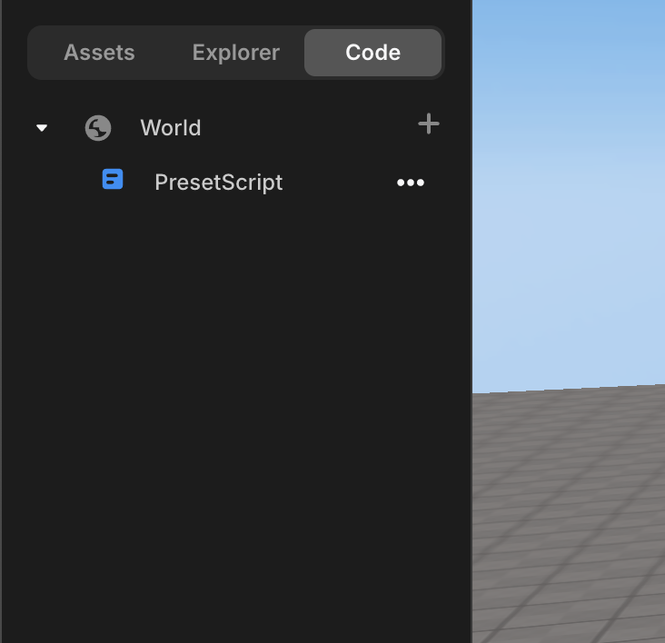
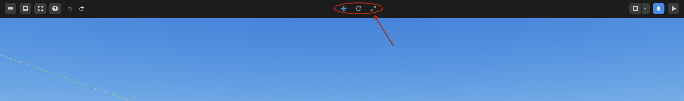

import { Callout } from "nextra/components";

# Top Panel

## Asset Library Panel Button

You can access the Asset Library by pressing the `≡` button on the top left. Users can get full access to the assets through this panel.

<Callout>
  More information about the Asset Library can be [found here](./left).
</Callout>

Asset Library

## Object & Scene Property Panel

To access the Scene and Object Property Panel, press the `<<<` button on the top right corner. Here, you can tweak properties of objects and the scene.

<Callout>
  More information about the Property Panel can be [found here](./right).
</Callout>

Property Panel

## Script Toggle

To access scripts in your project, press the `</>` button. This will open new Scripts in your left panel.

<Callout type="info" emoji="ℹ️">
  **Note:** If you want to know how to add, delete, and rename scripts, please
  take a look [here](../../../script/start/object).
</Callout>

Script Toggle

## File Menu

Press **File Menu** to access all the features listed down below.

From here, you can create new projects, save files, publish them, and more.

|    **List**    |               **Function**               |
| :------------: | :--------------------------------------: |
|      Save      |               Save Project               |
|  Save to File  |           Save project as JSON           |
| Open from File |         Import project from JSON         |
|   Import GLB   |                Import GLB                |
|   Export GLB   |           Save project as GLB            |
| Save as Asset  |      Save selected object as asset       |
|   Auto Save    | On/Off button for automated project save |

File Menu

## Help Menu

If you need support, press the **Help Menu** button, where you can access Discord and Wiki to get support.

Help Menu

## Undo & Redo

The top menu contains buttons that allow you to undo and redo actions.

<Callout>
Additionally, you can utilize keyboard shortcuts for undoing and redoing.

- To undo: `⌘ (CTRL) + Z`
- To redo: `⌘ (CTRL) + SHIFT + Z`

</Callout>

Undo & Redo Buttons

## Object Setting Button

The top menu contains buttons that allow you to move, rotate, and resize objects. Explore the various ways to set up an object using these functionalities.

<Callout>
  More information about object setting can be found [here](./top/set-object)
</Callout>

Object Setting Buttons

## Publish

Press the **Publish** button in the top right corner to publish your project on Redbrick.

Publish Button

## Play & Stop Buttons

Press the `[▶️]` button at the top center to enter Run Mode.

Play Button

---

Press the `[■]` button at the top center to revert to Edit Mode.

Stop Button

