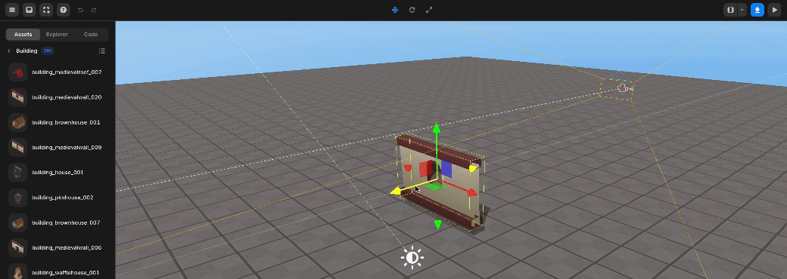
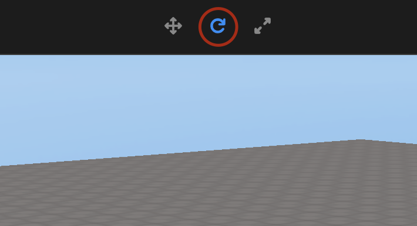
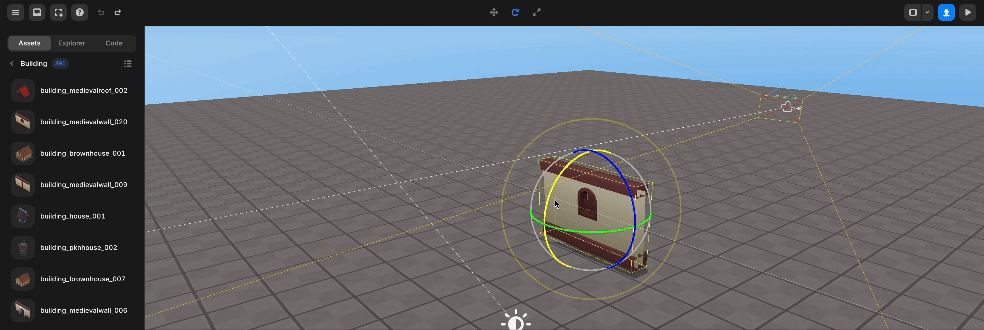
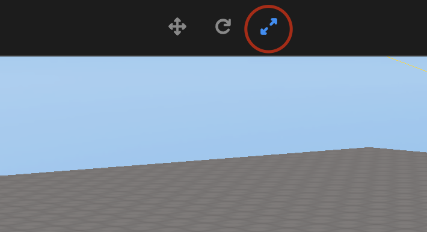
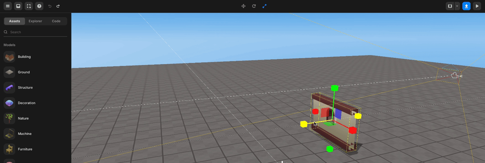

import { Callout } from "nextra/components";

# Set Object

> Provides instructions on how to move, rotate, and resize objects.

---

The second step in creating a world or game is to move, rotate, and resize the imported object and place it in the desired size in the desired position.

## Move

Click the object you want to reposition, and select the Move button on the top menu.

<Callout type="info" emoji="ℹ️">
  You can select the menu by pressing the keyboard number `[2]` button without
  clicking the Go button.
</Callout>

Move Button

Grasp the arrow in the direction you want to move, and drag it in the direction you want to move.

Object Move

## Rotate Object

Click the object you want to rotate, and select the Rotate button on the top menu.

<Callout type="info" emoji="ℹ️">
  You can select the menu by pressing the keyboard number `[3]` button without
  clicking the rotary button.
</Callout>

Rotate Button

Grasp the circle in the desired direction of rotation and turn it.

Object Rotate

## Resize Object

Click the object you want to resize, and select the resize button on the top menu.

<Callout type="info" emoji="ℹ️">
  You can select the menu by pressing the keyboard number `[4]` button without
  clicking the resize button.
</Callout>

Resize Button

Hold the line in the direction you want to resize, and pull it in the direction of stretching or decreasing.

Object Resize

