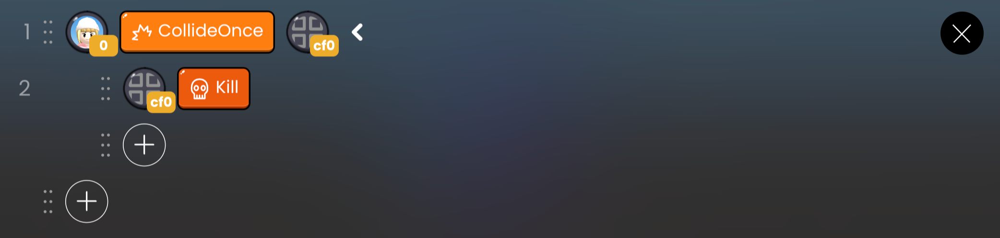

# 제어 API

| API 형식 | 연결된 블록 |                   기능                   |
| :------: | :---------: | :--------------------------------------: |
|    킬    |      -      | 실행 시 화면에서 객체를 보이지 않게 처리 |

## 킬

실행할 때 화면에서 객체가 보이지 않도록 처리합니다.

 

 OOBC 킬 샘플 코드

 

 OOBC 킬

