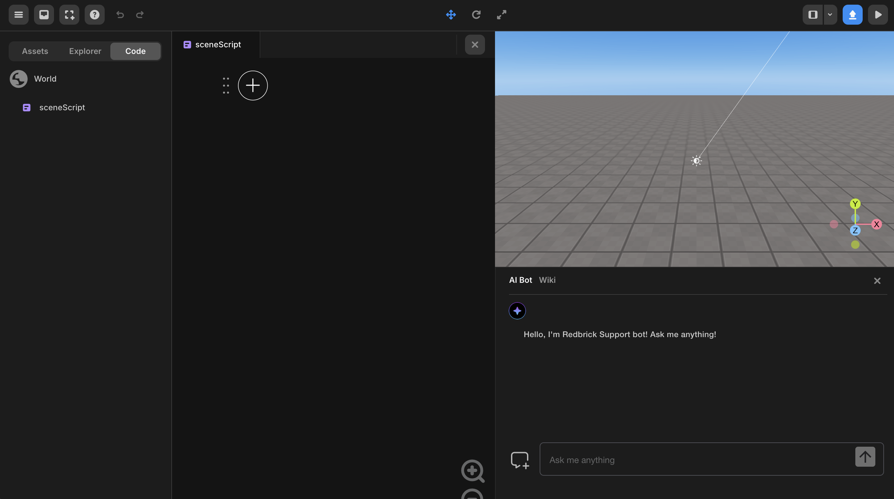

import { Callout } from "nextra/components";

# 블록 코딩 (OOBC)

> 블록 코딩 가이드

---

<Callout type="error" emoji="️‼️">
  레드브릭 스튜디오에 블록 코딩 명령어가 지속적으로 추가될 예정입니다.
</Callout>

 

  {" "}
   블록 코딩 (OOBC) 뷰{" "}

## 개요

블록 코딩으로 만든 프로젝트에서는 코드 버튼 `</>`을 클릭하여 코드 창을 열 수 있습니다.

코드 창에서 `[+]` 버튼을 눌러 코드 입력을 시작합니다.
