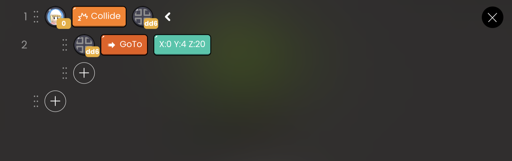

# 이동 API

| API 형식 | 연결된 블록 |                 기능                 |
| :------: | :---------: | :----------------------------------: |
|   GoTo   | X:0 Y:0 Z:0 |    지정된 좌표로 객체를 직접 이동    |
|    Go    |      x      | 객체를 x축 방향으로 지정된 대로 이동 |
|          |      y      | 객체를 y축 방향으로 지정된 대로 이동 |
|          |      z      | 객체를 z축 방향으로 지정된 대로 이동 |
|   이동   |      x      |  x축에서 지정된 거리만큼 객체 이동   |
|          |      y      |  y축에서 지정된 거리만큼 객체 이동   |
|          |      z      |  z축에서 지정된 거리만큼 객체 이동   |
|          |             |                                      |

## GoTo

지정된 좌표로 객체를 직접 이동시킵니다.

- `X:0 Y:0 Z:0`: x, y, z축 좌표를 순서대로 입력하세요.

 

 OOBC GoTo 샘플 코드

 

 OOBC GoTo

## Go

입력한 값에 따라 지정된 방향으로 객체를 직접 이동시킵니다.

`x` : x축 이동 거리를 입력하세요.

`y` : y축 이동 거리를 입력하세요.

`z` : z축 이동 거리를 입력하세요.

`up` : [Go] [y] [양수]와 같은 결과가 나타납니다.

`down` : [Go] [y] [음수]와 같은 결과가 나타납니다.

`left` : [Go] [x] [음수]와 같은 결과가 나타납니다.

`right` : [Go] [x] [양수]와 같은 결과가 나타납니다.

 

 OOBC Go 샘플 코드

 

 OOBC Go

## 이동

입력한 값에 따라 지정된 방향으로 객체를 이동시킵니다.

`x` : x축 이동 거리를 입력하세요.

`y` : y축 이동 거리를 입력하세요.

`z` : z축 이동 거리를 입력하세요.

`up` : 상승 이동 거리를 입력하세요.

- [이동] [y] [양수]와 같은 결과가 나타납니다.

`down` : 하강 이동 거리를 입력하세요.

- [이동] [y] [음수]와 같은 결과가 나타납니다.

`left` : 좌측 이동 거리를 입력하세요.

- [이동] [x] [음수]와 같은 결과가 나타납니다.

`right` : 우측 이동 거리를 입력하세요.

- [이동] [x] [양수]와 같은 결과가 나타납니다.

 

 OOBC 이동 샘플 코드

 

 OOBC 이동

