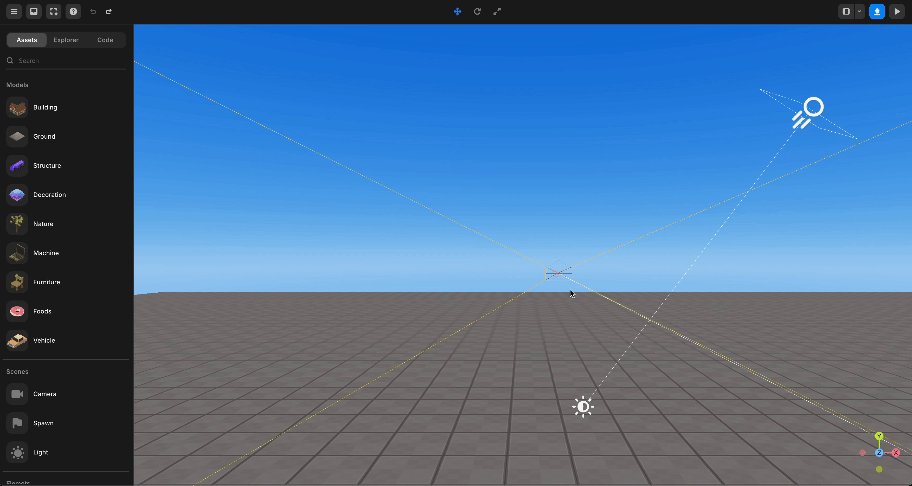

# 엔진에서 작동하는 방법

> 레드브릭 스튜디오의 기본 화면 작동 방법에 대한 지침을 제공합니다.

---

레드브릭 엔진을 잘 활용하려면 화면 조작 방법에 익숙해져야 합니다.

아래 세 가지 방법을 잊지 마세요.

## 왼쪽 클릭 - 마우스

왼쪽 마우스 버튼을 클릭하고 화면을 밀어서 화면을 회전시킵니다.

 

   왼쪽 클릭 - 마우스

## 오른쪽 클릭 - 마우스

오른쪽 마우스 클릭으로 화면을 밀어 시점을 이동시킵니다.

 

   오른쪽 클릭 - 마우스

## 마우스 스크롤

마우스 스크롤 버튼을 클릭하고 화면을 밀어 확대/축소합니다.

 

   마우스 스크롤

## 키보드 조작 방법

`WASDQE` 버튼을 사용하여 카메라를 제어합니다.

- W: 카메라가 바라보는 방향으로 전진합니다.
- A: 카메라가 바라보는 방향과 상대적으로 왼쪽으로 이동합니다.
- S: 카메라가 바라보는 방향과 상대적으로 오른쪽으로 이동합니다. D: 카메라가 바라보는 방향을 반대로 합니다.
- Q: 카메라가 바라보는 방향 아래로 하강합니다.
- E: 카메라가 바라보는 방향 위로 상승합니다.
