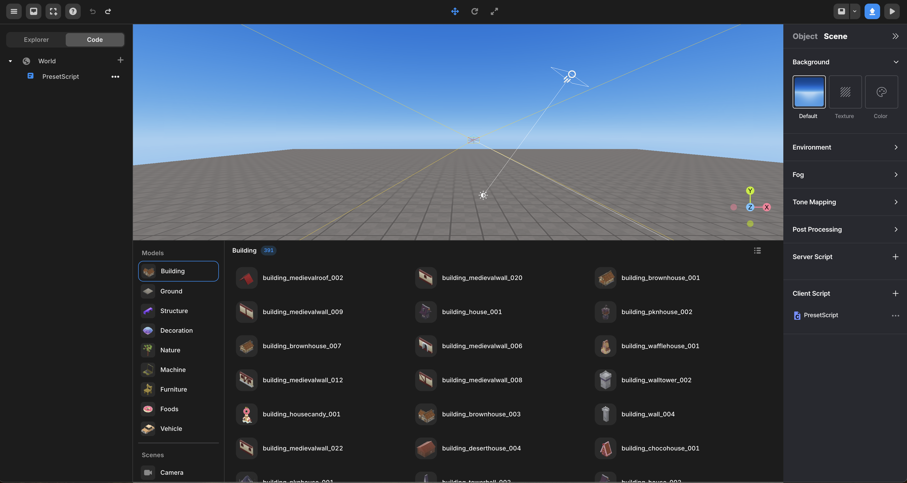

import { Cards } from "nextra/components";

# 툴바 & 패널들

 

 엔진 뷰

 

<Cards>
  <Cards.Card title="상단 패널" href="./operate/top" />
  <Cards.Card title="에셋 라이브러리,코드 패널" href="./operate/left" />
  <Cards.Card title="속성 패널" href="./operate/right" />
</Cards>
