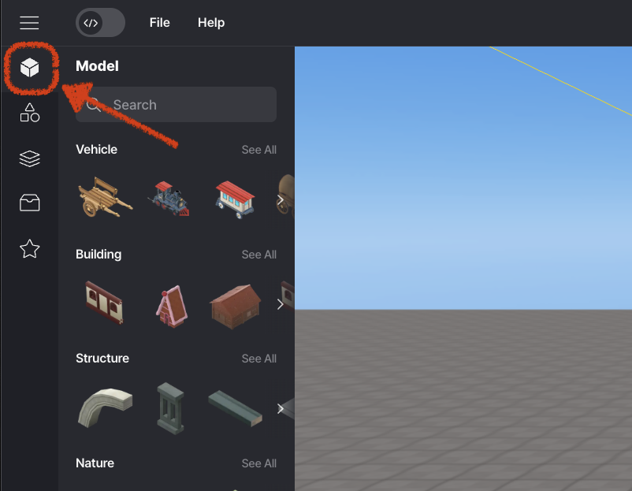
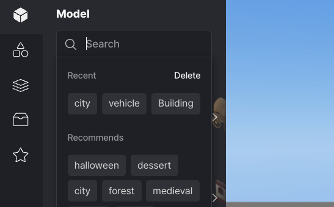
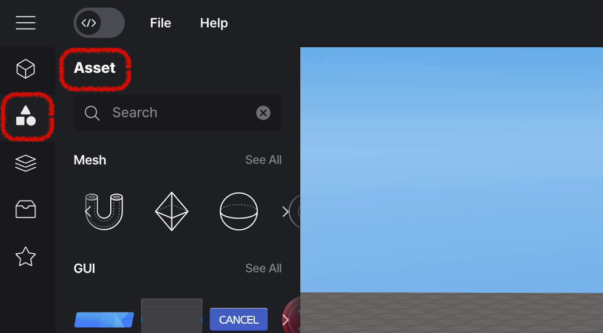
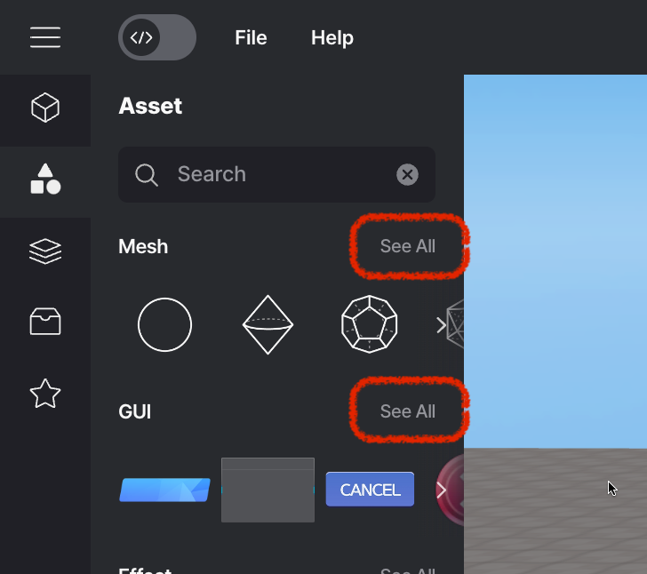
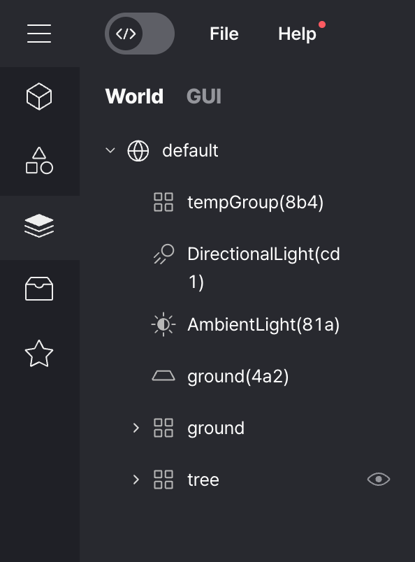
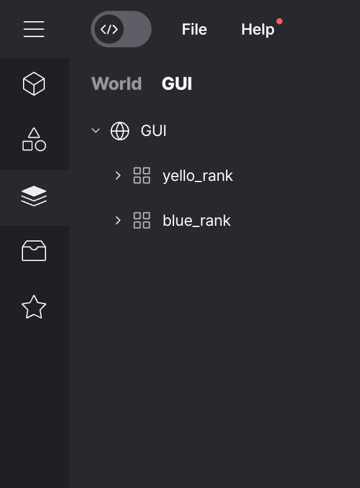

import { Callout } from "nextra/components";
import Image from "next/image";

# 에셋 라이브러리 패널 (왼쪽 패널)

레드브릭 스튜디오에서 세계를 구성하는 시각적 요소들을 객체라고 합니다.

`≡` 버튼을 눌러 패널을 열고 에셋 라이브러리를 통해 객체를 얻을 수 있습니다.

## 모델

모델 섹션에서는 프로젝트에 필요한 모든 유형의 3D 모델을 찾을 수 있습니다.

 

 모델

### 검색

패널 상단의 검색 기능을 사용하여 원하는 객체를 쉽게 찾을 수 있습니다.

검색어 텍스트 박스에 원하는 단어를 입력하고 Enter 키를 누릅니다.

검색 결과에 해당하는 객체가 나타납니다.

 

 검색

## 에셋

에셋은 라이브러리에서 가져온 완성된 모델을 의미합니다.

 

 에셋

'모두 보기'를 클릭하여 모든 에셋에 접근할 수 있습니다.

<Callout type="info" emoji="ℹ️">
  에셋과 관련된 더 많은 정보는 [여기](./left/asset)에서 찾을 수 있습니다.
</Callout>
 

   모두 보기

## 레이어

에셋 레이어를 확장하는 버튼을 누르면 객체나 GUI를 조작할 수 있습니다.

 

세계             |  GUI
:-------------------------:|:-------------------------:
  |  

왼쪽은 객체가 표시되는 장면 레이어이고, 오른쪽은 GUI가 표시되는 GUI 레이어입니다.

<Callout type="info" emoji="ℹ️">
  기본적으로 [다음 기능들을 사용할 수 있습니다](./left/layer).
</Callout>

## 내 에셋

레드브릭 스튜디오에서 제공하는 객체 외에도 자체 커스텀 에셋을 추가하여 사용할 수 있습니다.

<Callout type="info" emoji="ℹ️">
  내 에셋과 관련된 더 많은 정보는 [여기](./left/my-asset)에서 찾을 수 있습니다.
</Callout>

## 스크립트 (코드 스크립트 켜기)

<Callout type="warning" emoji="⚠️"></Callout>
