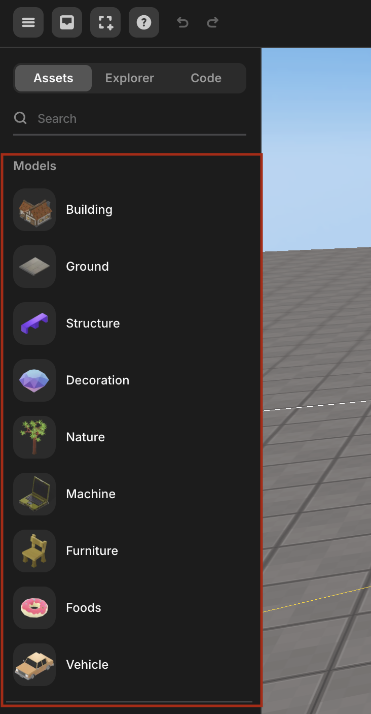
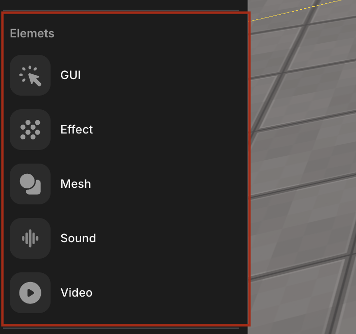

import { Callout } from "nextra/components";
import Image from "next/image";

# 에셋 라이브러리, 코드 패널 (왼쪽, 아래 패널)

레드브릭 스튜디오에서 세계를 구성하는 시각적 요소들을 객체라고 합니다.

`v` 버튼을 눌러 왼쪽 패널 열고 에셋 라이브러리를 통해 객체를 얻을 수 있고 코드 스크립트에 접근할 수 있습니다.

아래쪽 패널을 열어 에셋 라이브러리에만 접근할 수도 있습니다.

## 모델

모델 섹션에서는 프로젝트에 필요한 모든 유형의 3D 모델을 찾을 수 있습니다.

 

 모델

### 검색

패널 상단의 검색 기능을 사용하여 원하는 객체를 쉽게 찾을 수 있습니다.

검색어 텍스트 박스에 원하는 단어를 입력하고 Enter 키를 누릅니다.

검색 결과에 해당하는 객체가 나타납니다.

 

 검색

## 씬

씬에서는 카메라, 스폰 지점, 빛을 추가할 수 있습니다.

 

 씬

## 구성 요소

구성 요소에서는 GUI, 이펙트, 메시, 사운드, 비디오를 추가할 수 있습니다.

 

 구성 요소

<Callout type="info" emoji="ℹ️">
  에셋과 관련된 더 많은 정보는 [여기](./left/asset)에서 찾을 수 있습니다.
</Callout>

## 탐색기

Explorer 버튼을 누르면 객체나 GUI를 조작할 수 있습니다.

 

세계             |  GUI
:-------------------------:|:-------------------------:
  |  

왼쪽은 객체가 표시되는 씬 레이어이고, 오른쪽은 GUI가 표시되는 GUI 레이어입니다.

<Callout type="info" emoji="ℹ️">
  기본적으로 [다음 기능들을 사용할 수 있습니다](./left/layer).
</Callout>

## 코드 스크립트

Code 버튼을 눌러 코드 스크립트를 열 수 있습니다

<Callout type="info" emoji="ℹ️">
  **참고:** 스크립트를 추가, 삭제, 이름 변경하는 방법을 알고 싶다면
  [여기](../../../script/start/object)를 확인하세요.
</Callout>

코드 스크립트
