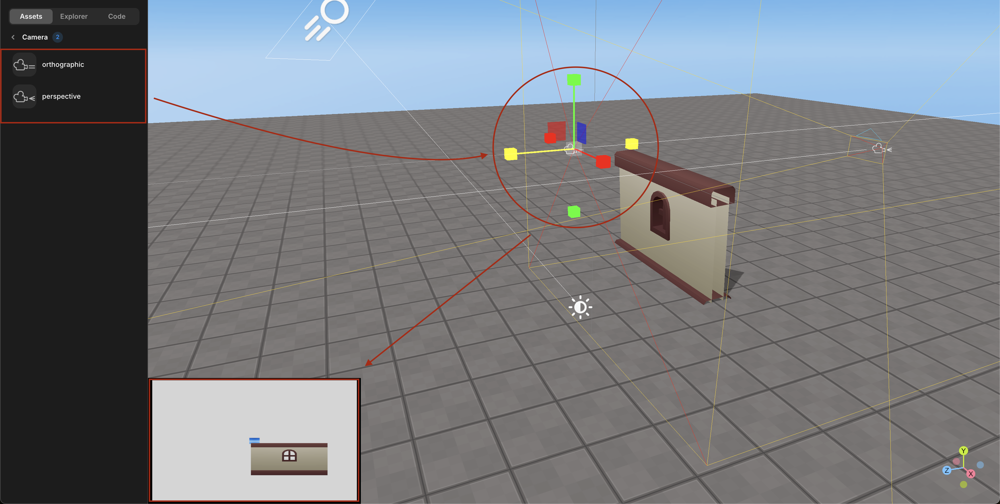

# 에셋

## 메시

메시는 스튜디오에서 제공하는 기본 기하학적 형태를 의미합니다.

여러 기본 형태를 사용하여 자신만의 객체를 완성할 수 있습니다.

 

 메시

## GUI

GUI는 Graphic User Interface의 약자로, 세계 내에서 사용자의 입력 및 출력을 편하게 도와주는 인터페이스를 말합니다.

스크립트를 작성하여 버튼이나 타이머 등 다양한 방식으로 사용할 수 있습니다.

 

 GUI

## 비디오

세계 내에서 재생할 수 있는 평면(2차원) 비디오를 제공합니다. 비디오를 클릭하여 미리보기를 할 수 있으며, 세계 내로 드래그하여 비디오 객체를 추가할 수 있습니다.

플레이 모드로 들어가면 비디오가 재생됩니다.

 

 비디오

## 사운드

다양한 배경 음악과 사운드 효과를 사용할 수 있습니다. 사운드를 클릭하여 미리 들어볼 수 있으며, 세계 내로 드래그하여 사운드 객체를 추가할 수 있습니다.

특정 상황에서만 사운드가 재생되도록 스크립트를 작성할 수 있습니다.

 

 사운드

## 라이트

세계 내에 추가할 수 있는 라이트 객체가 제공됩니다.

라이트를 사용하여 다양한 모양을 만들 수 있습니다.

 

 라이트

## 이펙트

다양한 파티클 이펙트를 사용할 수 있습니다.

색상, 속도 등을 설정하여 이펙트를 만들 수 있습니다.

 

 이펙트

## 스폰

플레이 모드로 들어갈 때, 아바타의 출현 위치를 설정하는 타일과 다른 게임으로 이동하는 포털이 제공됩니다.

 

 스폰

아바타의 출현 위치를 설정하기 위해 타일의 위치를 조정할 수 있습니다.

 

   시작점

## 광고 에셋

광고를 올릴 수 있는 에셋을 제공합니다.

 

 광고 에셋

## 카메라

장면에 추가할 수 있는 두 가지 유형의 카메라, 원근법과 직각법이 있습니다.

 

   카메라 에셋

