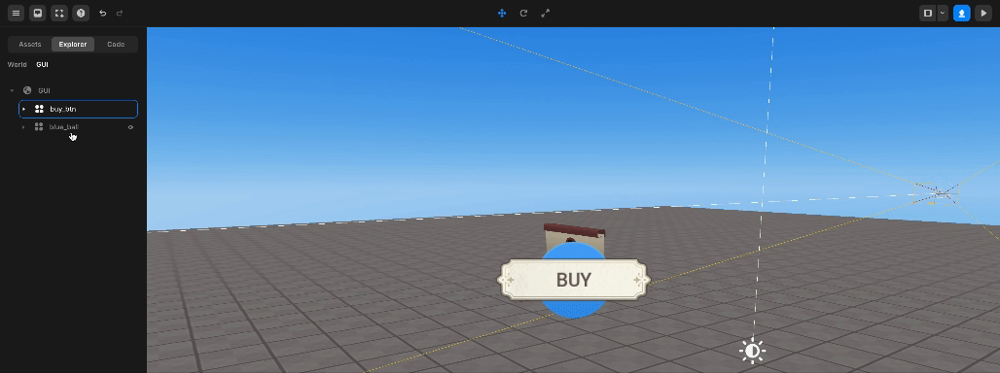

# 레이어

## 객체 / GUI 선택하기

객체를 클릭하면 선택할 수 있습니다.

## 객체 / GUI 보이기 & 숨기기

객체나 GUI를 왼쪽 클릭하여 보이지 않게 할 수 있습니다.

다시 클릭하면 객체나 GUI가 보이게 됩니다.

보이기/숨기기 기능은 자식 객체에 자동으로 적용됩니다.

 

 숨기기 & 보이기

## 객체 / GUI 순서 변경하기

에셋 레이어에서 객체나 GUI를 드래그하여 원하는 위치로 이동함으로써 순서를 변경할 수 있습니다.

객체의 경우 순서는 의미가 없지만, GUI의 경우 가장 아래에 있는 GUI가 화면에 가장 잘 보이게 되며 클릭 시 가장 먼저 선택됩니다.

 

 순서 변경하기

## 하위 그룹으로 포함시키기 / 그룹에서 제거하기

에셋 레이어에서 특정 객체나 GUI를 드래그하여 이동함으로써 다른 요소의 자식으로 객체나 GUI를 포함시키거나 부모로부터 분리할 수 있습니다.

 

   하위 그룹으로 포함 / 그룹에서 제거하기

