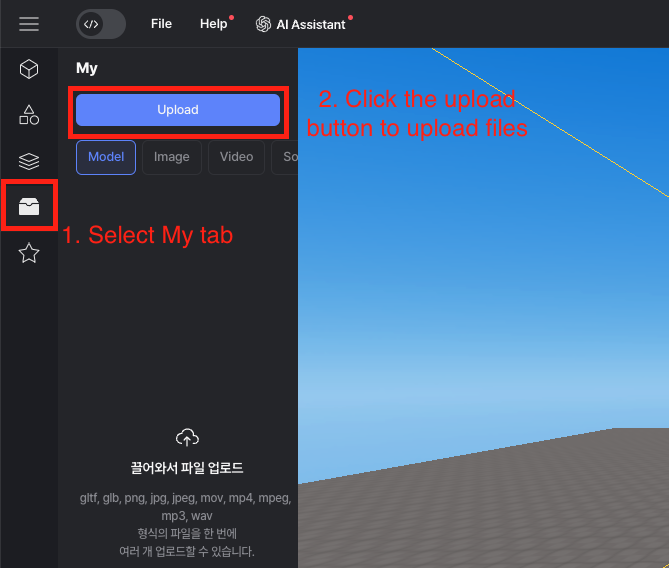
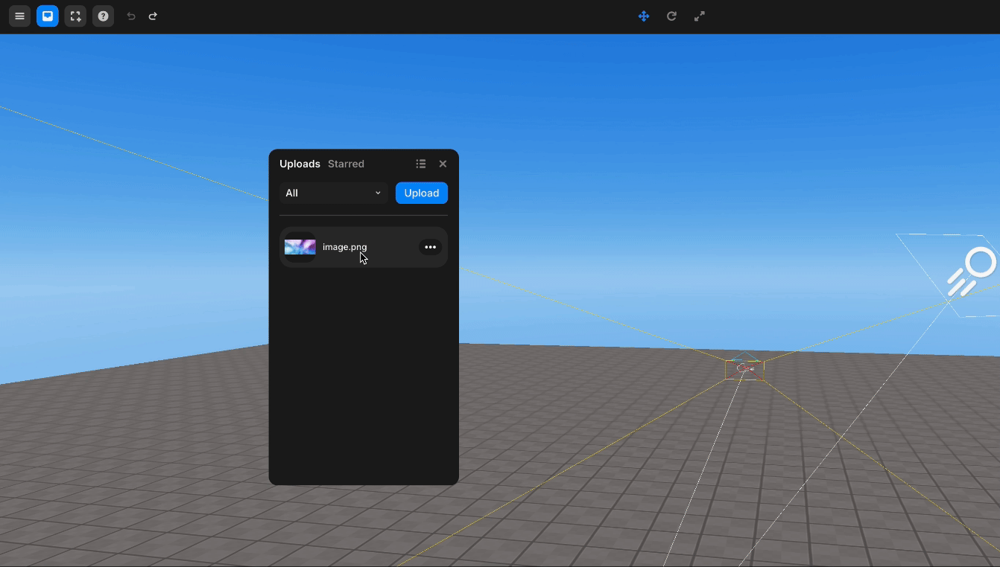
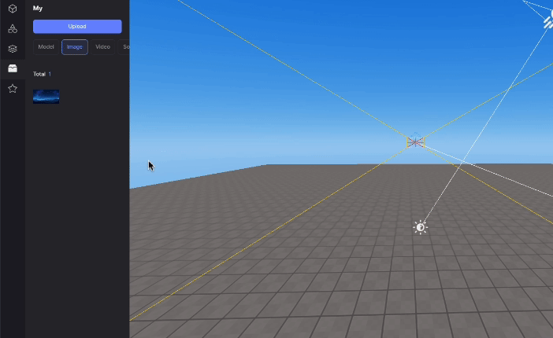

import { Callout } from "nextra/components";

# My 에셋

커스텀 에셋을 모델, 이미지, 비디오, 사운드 형식으로 업로드하여 사용할 수 있습니다.

<Callout type="warning">
  다음 형식의 파일을 지원합니다: `gltf, glb, png, jpg, jpeg, mov, mp4, mpeg,
  mp3, wav`.
</Callout>

## My 에셋 사용 방법

왼쪽 패널을 통해 `[My]` 카테고리로 들어간 후, 업로드 버튼을 눌러 사용하고 싶은 파일을 업로드 합니다.  

 

<Callout type="info">
  추가된 파일들은 자동으로 분류되며 My > 모델, 이미지, 비디오, 사운드 탭에서
  사용할 수 있습니다.
</Callout>

업로드 된 항목을 씬에 추가하여 사용할 수 있는데, 두가지 방식이 있습니다.  
3D Object로 씬에 추가하거나, GUI 오브젝트로 씬에 추가하는 방법입니다.  
3D 오브젝트와 GUI 오브젝트의 차이점은 [이곳](../../../script/start/3d-and-gui-object#3d-오브젝트와-gui-오브젝트의-차이)을 참고하세요.  

### 3D 오브젝트로 씬에 추가하기

항목을 좌클릭하거나, 드래그하여 씬으로 끌어다 놓으면 3D 오브젝트로써 WORLD의 자식으로 추가됩니다.  

 
  항목을 좌클릭하여 3D 오브젝트로 추가
   
  항목을 씬에 드래그-드롭하여 3D 오브젝트로 추가

### GUI 오브젝트로 씬에 추가하기

항목에 마우스를 올리면 나타나는 점 3개를 클릭한 후, Add to GUI를 선택하면 GUI 오브젝트로써 GUI의 자식으로 추가됩니다.  
GUI 오브젝트로 추가할 수 있는 건 이미지나 GUI 파일뿐입니다.  

 
  GUI 오브젝트로 씬에 추가하기

