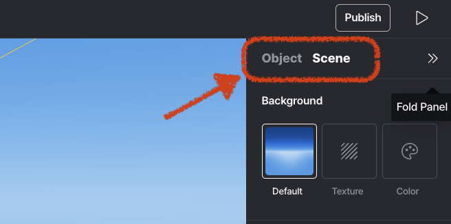

import { Cards } from "nextra/components";

# 속성 패널 (오른쪽 패널)

> 속성 패널에는 **객체**와 **씬** 두 부분이 있습니다.

---

객체와 씬

---

<Cards>
  <Cards.Card title="객체" href="./right/object" />
  <Cards.Card title="씬" href="./right/scene" />
</Cards>
