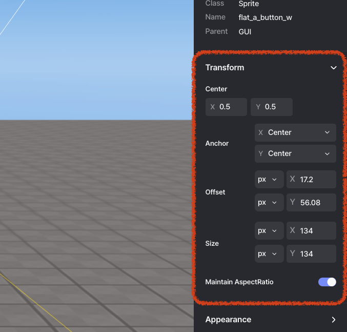

import { Callout } from "nextra/components";

# GUI Transform

> GUI 요소 변환에 대한 안내입니다.

---

   GUI 변환

GUI 요소를 배치하는 경우, 앵커와 오프셋을 기준으로 위치를 조정합니다.

---

## Center

GUI의 중심 위치를 지정하는 속성입니다.

X는 0에서 1 사이의 값으로 표현되며, 0은 GUI의 왼쪽 끝, 1은 오른쪽 끝을 의미합니다.

Y는 0에서 1 사이의 값으로 표현되며, 0은 GUI의 아래쪽 끝, 1은 위쪽 끝을 의미합니다.

기본적으로 중간값에 해당하는 0.5 / 0.5 값으로 설정됩니다.

## Anchor

GUI의 중심이 화면에서 어디에 위치할지를 지정하는 속성입니다.

<Callout type="info" emoji="ℹ️">
  X에는 세 가지 옵션이 있습니다: Far-Left, Center, Far-Right로, 각각 부모 요소의
  X축 0%, 50%, 100% 지점에 해당합니다.
</Callout>

<Callout type="info" emoji="ℹ️">
  Y에는 세 가지 옵션이 있습니다: Bottom, Center, Top으로, 각각 부모 요소의 Y축
  0%, 50%, 100% 지점에 해당합니다.
</Callout>

## Offset

GUI가 앵커로부터 얼마나 떨어져 있는지를 지정하는 속성입니다.

X와 Y 값을 지정하여 각 축 방향으로 지정된 값만큼 오프셋을 가집니다.

<Callout type="info" emoji="ℹ️">
  단위는 `px`와 `%` (퍼센트) 두 가지가 있습니다.
</Callout>

px의 경우 지정된 값에 해당하는 고정 픽셀 값으로 오프셋이 적용됩니다. 항상 고정 거리를 유지해야 할 때 사용할 수 있습니다.

`%`의 경우 x축과 y축이 각각 부모 요소의 너비와 높이 대비 지정된 퍼센트 값만큼 오프셋됩니다. 부모 요소의 크기가 실제 오프셋 크기를 결정하기 때문에 화면 크기에 따라 유연한 배치가 필요하거나 다른 GUI의 자식으로 GUI를 포함하여 상대적인 오프셋을 유지하고자 할 때 유용합니다.

## Size

GUI의 크기를 지정하는 속성입니다.

X와 Y 값을 지정하여 각 축 방향으로 지정된 값만큼 크기를 가집니다.

<Callout type="info" emoji="ℹ️">
  단위는 `px`와 `%` (퍼센트) 두 가지가 있습니다.
</Callout>

PX의 경우 지정한 값에 해당하는 고정 픽셀 값으로 크기가 설정됩니다. 고정 크기의 GUI를 배치하고 싶을 때 사용할 수 있습니다.

`%`의 경우 x축과 y축이 각각 부모 요소의 너비와 높이 대비 지정된 퍼센트 값만큼 크기가 설정됩니다. 부모 요소의 크기가 실제 크기를 결정하기 때문에 화면 크기에 따라 유연한 배치가 필요하거나 다른 GUI의 자식으로 GUI를 포함하여 상대적인 크기를 유지하고자 할 때 유용합니다.

## MaintainAspectRatio

GUI의 고유한 종횡비가 유지되는지 여부를 결정하는 값입니다.

기본적으로 체크되어 있으며, 체크되어 있으면 종횡비를 유지합니다. 종횡비를 유지함으로써 X 또는 Y 중 하나를 무시할 수 있습니다.

체크를 해제하면 종횡비가 무시되고 사용자가 지정한 크기로 GUI가 변경됩니다.
