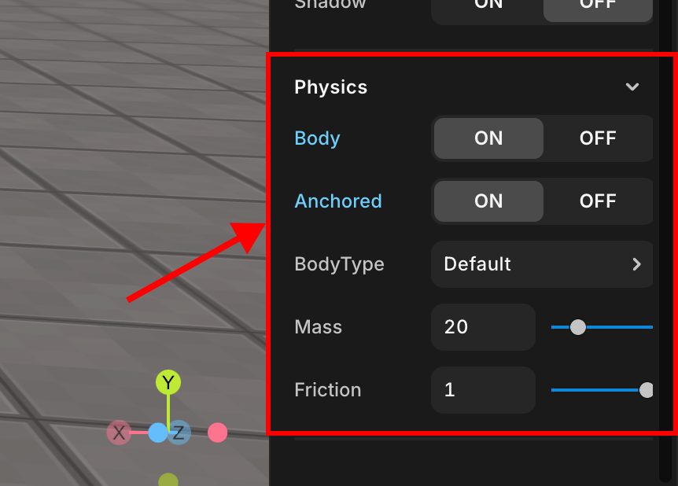

import { Callout } from "nextra/components";

# Physics

> 객체의 물리적 속성을 지정할 수 있습니다.

<br />

<center>Physics</center>

## Body

객체가 물리적 몸체를 포함하고 있는지 여부를 결정합니다. 체크되지 않은 경우, 객체는 물리적으로 영향을 받지 않습니다. 아래 속성들은 Body가 있을 때만 표시됩니다.

<Callout type="error" emoji="️‼️">
  코드를 통해 "Body"가 있는 객체를 이동시킬 때 다음 사항을 알아두어야 합니다.
</Callout>

객체의 위치/회전 값은 객체의 몸체에 의존합니다. 위치, 회전 값이 TWEEN을 사용하여 설정되거나 변경되었지만 몸체가 변경되지 않은 경우, 객체의 위치는 이동하지 않습니다. 따라서, 속성 needUpdate와 같이 객체를 이동/회전한 후에는 몸체를 업데이트해야 합니다.

```js showLineNumbers
const obj = WORLD.getObject("MyObject");

obj.position.set(0, 0, 0);
obj.body.needUpdate = true;
```

### Anchored

객체의 상태가 운동으로 변경됩니다. 충돌 등으로 인해 위치가 변하지 않으며, 스크립팅 등을 통해 위치를 직접 변경하면 위치가 변경될 수 있습니다. 객체 충돌을 사용하면서 고정된 장소에 배치하고 싶다면 사용할 수 있습니다.

### BodyType

3D 모델에서 형성될 물리적 형태(Body)를 지정할 수 있습니다. 다섯 가지 옵션이 있으며, 각각 다음과 같이 생성됩니다.

- Box: 3D 모델 전체를 포함할 수 있는 가장 작은 직육면체 몸체를 생성합니다.
- Sphere: 3D 모델의 평균 길이, 너비, 높이를 지름으로 하는 구체 몸체를 생성합니다.
- Hull: 3D 모델의 가장 바깥쪽 꼭지점을 기반으로 몸체를 생성합니다.
- Convex: 3D 모델의 모든 부분이 밖으로 돌출하거나 돌출하지 않는 몸체를 생성합니다.
- Concave: 3D 모델의 일부가 내부로 들어가거나 오목한 형태를 가진 몸체를 생성합니다.

### Mass

객체의 질량을 지정합니다.

### Friction

객체의 마찰력을 지정합니다. 값은 0에서 1 사이입니다.
