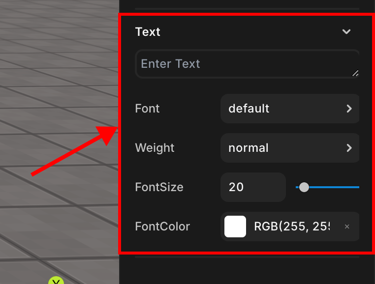

import { Callout } from "nextra/components";

# Text

> GUI 객체의 텍스트 속성을 지정할 수 있습니다.

 
Text 속성
 

텍스트, 폰트, 굵기, 사이즈, 색깔과 같은 텍스트 속성을 설정할 수 있습니다.  
GUI 오브젝트에만 존재하는 속성입니다.  

## TextInput

기본적으로 보일 텍스트 내용을 입력합니다.  
해당 속성에 값을 입력하면 [`.setText()`](../../../../script/api/sprite#settext) 메소드로 값을 수정하기 전까지는 지속적으로 해당 텍스트가 출력됩니다.  

## Font

텍스트의 폰트를 지정합니다.

## Weight

텍스트의 굵기를 지정합니다.

## FontSize

텍스트 크기를 지정합니다.

## FontColor

텍스트의 색깔을 지정합니다.