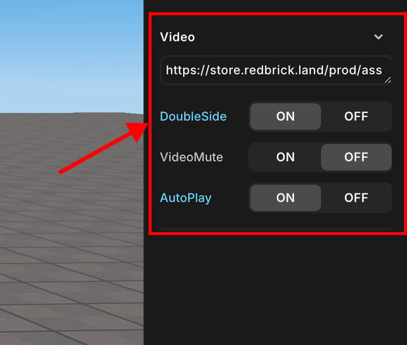

# Video

> 비디오 속성에 대한 안내입니다.

볼륨, 지속 시간, 루프, 위치 속성 등 비디오 객체의 속성을 설정할 수 있습니다. 일부 속성은 오디오 객체에만 존재한다는 점에 유의하세요.

 

 비디오

## VideoSource

주소를 통해 실행될 비디오를 불러옵니다.

## Double Side

객체의 양면에서 시각화를 가능하게 합니다.

## Video Mute

비디오 객체를 음소거합니다.

## Auto Play

이 옵션이 켜져 있으면 비디오 객체가 자동으로 재생됩니다.
