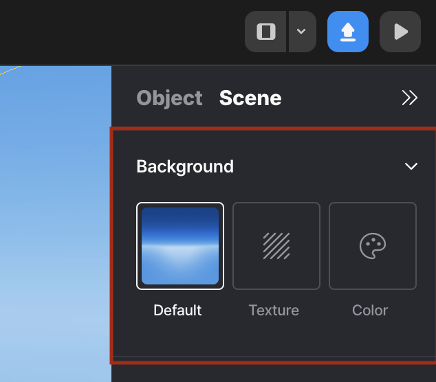
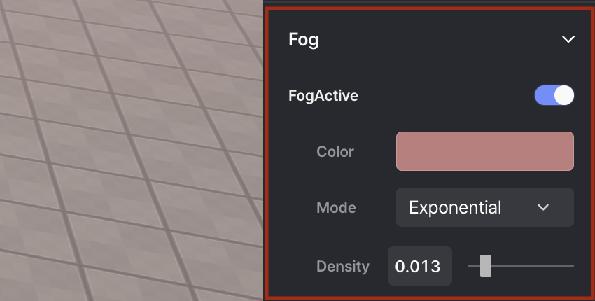
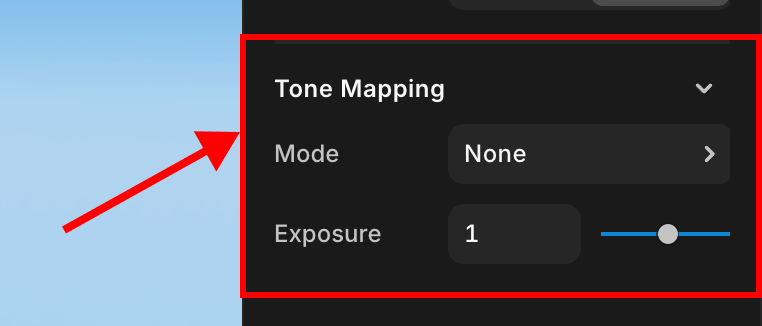
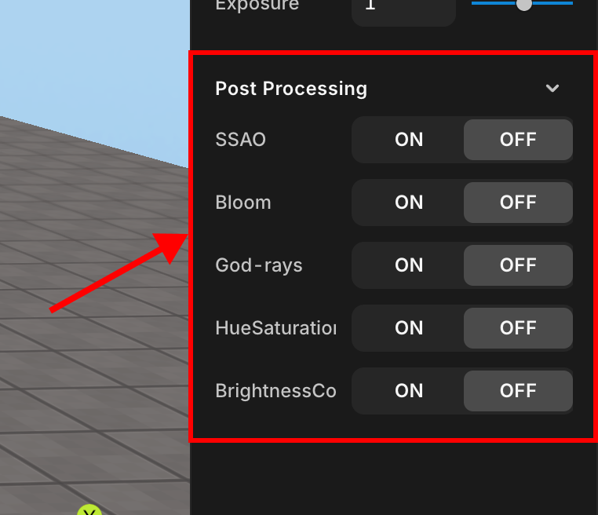
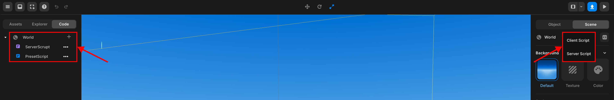

# 씬

배경, 맵 환경, 안개, 톤, 후처리 효과, 스크립트 관리를 할 수 있습니다.

## 배경

배경의 색을 변경하거나 원하는 이미지를 넣을 수 있습니다.

 

   배경

## 맵 환경

 

   맵 환경

## 안개

FogActive 토글을 눌러 씬에 원하는 색과 형태의 안개를 추가할 수 있습니다.

 

   안개

## 톤

씬의 밝기와 색상을 조절하는 기능입니다. 모드와 노출 값을 조절해서 원하는 정도의 밝기를 만들 수 있습니다.

 

   톤

## 후처리 효과

씬에 후처리 효과를 추가해 씬을 더 매끄럽고 현실감있게 표현할 수 있습니다.  

후처리 효과로는 SSAO, Bloom, God-rays, HueSaturation, BrightnessContrast가 있습니다.

- **SSAO**: 씬에서 물체들이 서로 가깝게 배치된 곳(예: 모서리나 접합부)에서 그림자가 자연스럽게 드리워지도록 만드는 효과입니다.
- **Bloom**: 화면의 밝은 부분에서 빛이 번지는 효과를 만들어냅니다.
- **God-rays**: 빛의 기둥처럼 보이는 효과로, 햇빛이 나뭇잎 사이로 비추거나 먼지가 낀 공간을 통과하는 빛을 표현할 때 사용됩니다.
- **HueSaturation**: 색조와 채도를 조정하는 효과입니다.
- **BrightnessContrast**: 밝기는 화면의 전체적인 밝기를 조절하고, 대비는 밝고 어두운 부분의 차이를 강조하는 효과입니다.

 

   후처리 효과

## 스크립트 관리

서버와 클라이언트 스크립트를 생성할 수 있습니다.

 

   스크립트 관리

