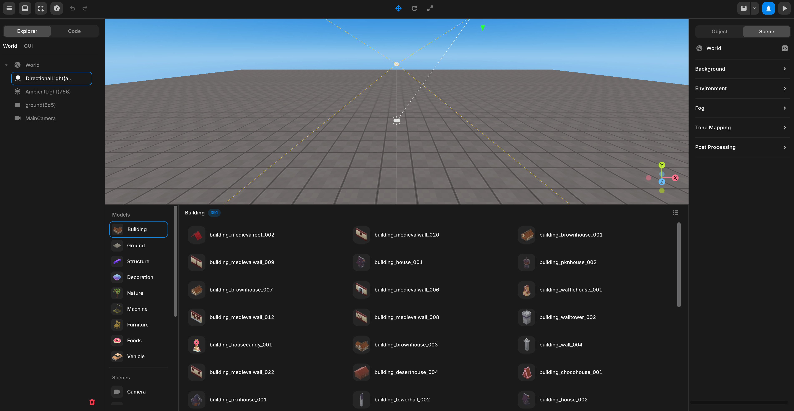

import { Callout } from "nextra/components";

# 상단 패널

## 파일 메뉴

**파일 메뉴**를 눌러 아래에 나열된 모든 기능에 접근할 수 있습니다.

여기서 파일을 저장하고, 게시할 수 있고, 객체를 에셋으로 저장할 수 있습니다.

|  **리스트**   |            **기능**            |
| :-----------: | :----------------------------: |
|     저장      |         프로젝트 저장          |
|  파일로 저장  |     JSON으로 프로젝트 저장     |
| 파일에서 열기 |   JSON에서 프로젝트 가져오기   |
| GLB 가져오기  |          GLB 가져오기          |
| GLB 내보내기  |      GLB로 프로젝트 저장       |
| 에셋으로 저장 |  선택된 객체를 에셋으로 저장   |
| 도우미 |  빛이나 카메라 위치 등을 표시   |
|   자동 저장   | 프로젝트 자동 저장 On/Off 버튼 |

파일 메뉴

## My 에셋

커스텀 에셋을 모델, 이미지, 비디오, 사운드 형식으로 업로드하여 사용할 수 있습니다.

<Callout type="warning">
  다음 형식의 파일을 지원합니다: `gltf, glb, png, jpg, jpeg, mov, mp4, mpeg,
  mp3, wav`.
</Callout>

<Callout type="error" emoji="️🚫">
  그림판 3D를 거친 `gltf, glb` 파일을 넣을 경우, 프로젝트 파일이 망가지니 절대 넣지 마세요.
</Callout>

### My 에셋 사용 방법

상단 패널을 통해 `[My]` 카테고리로 들어간 후, 업로드 버튼을 눌러 사용하고 싶은 파일을 업로드 합니다.  

 

<Callout type="info">
  추가된 파일들은 자동으로 분류되며 My > 모델, 이미지, 비디오, 사운드 탭에서
  사용할 수 있습니다.
</Callout>

업로드 된 항목을 씬에 추가하여 사용할 수 있는데, 두가지 방식이 있습니다.  
3D Object로 씬에 추가하거나, GUI 오브젝트로 씬에 추가하는 방법입니다.  
3D 오브젝트와 GUI 오브젝트의 차이점은 [이곳](../../script/start/3d-and-gui-object#3d-오브젝트와-gui-오브젝트의-차이)을 참고하세요.  

### 3D 오브젝트로 씬에 추가하기

항목을 좌클릭하거나, 드래그하여 씬으로 끌어다 놓으면 3D 오브젝트로써 WORLD의 자식으로 추가됩니다.  

 
  항목을 좌클릭하여 3D 오브젝트로 추가
   
  항목을 씬에 드래그-드롭하여 3D 오브젝트로 추가

### GUI 오브젝트로 씬에 추가하기

항목에 마우스를 올리면 나타나는 점 3개를 클릭한 후, Add to GUI를 선택하면 GUI 오브젝트로써 GUI의 자식으로 추가됩니다.  
GUI 오브젝트로 추가할 수 있는 건 이미지나 GUI 파일뿐입니다.

 
  GUI 오브젝트로 씬에 추가하기

## 템플릿

<Callout type="error" emoji="️🚫">
  업데이트가 완료되면 추가될 예정입니다.
</Callout>

## 도움말 메뉴

도움이 필요한 경우 **도움말 메뉴** 버튼을 눌러 디스코드 및 위키에서 지원을 받거나 튜토리얼 영상을 시청할 수 있습니다.

도움말 메뉴

## 실행 취소 & 다시 실행

상단 메뉴에는 작업을 실행 취소하고 다시 실행할 수 있는 버튼이 있습니다.

<Callout>
또한, 실행 취소 및 다시 실행을 위한 키보드 단축키를 사용할 수 있습니다.

- 실행 취소: `⌘ (CTRL) + Z`
- 다시 실행: `⌘ (CTRL) + SHIFT + Z`

</Callout>

실행 취소 & 다시 실행 버튼

## 객체 설정 버튼

상단 메뉴에는 객체를 이동, 회전, 크기 조정할 수 있는 버튼이 있습니다. 이 기능들을 사용하여 객체를 다양한 방법으로 설정해보세요.

<Callout>
  객체 설정에 대한 자세한 정보는 [여기에서 확인할 수 있습니다](./top/set-object)
</Callout>

객체 설정 버튼

## 패널

오른쪽 상단의 `v` 버튼을 눌러 원하는 패널에 접근할 수 있습니다.  
Left를 누를 시 에셋 라이브러리, 코드 패널이 열리고 Right를 누를 시 속성 패널이 열립니다.  
Botton을 누르면 아래에 에셋 라이브러리만 열립니다.

<Callout>
  에셋 라이브러리, 코드 패널에 대한 자세한 정보는 [여기에서 확인할 수 있습니다](./left).
</Callout>

<Callout>
  속성 패널에 대한 자세한 정보는 [여기에서 확인할 수 있습니다](./right).
</Callout>

패널

모든 패널 보이기

## 게시하기

오른쪽 상단의 게시하기 버튼을 눌러 프로젝트를 레드브릭에 게시하세요.

게시하기 버튼

## 재생 & 정지 버튼

상단 우측의 `[▶️]` 버튼을 눌러 실행 모드로 들어갑니다.

재생 버튼

상단 우측의 `[■]` 버튼을 눌러 편집 모드로 되돌립니다.

정지 버튼

