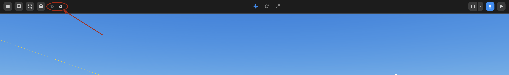

import { Callout } from "nextra/components";

# 상단 패널

## 에셋 라이브러리 패널 버튼

왼쪽 상단의 `≡` 버튼을 눌러 에셋 라이브러리에 접근할 수 있습니다. 이 패널을 통해 사용자는 에셋에 대한 전체 접근 권한을 얻을 수 있습니다.

<Callout>
  에셋 라이브러리에 대한 자세한 정보는 [여기에서 확인할 수 있습니다](./left).
</Callout>

에셋 라이브러리

## 객체 & 장면 속성 패널

장면 및 객체 속성 패널에 접근하려면 오른쪽 상단 모서리의 `<<<` 버튼을 누릅니다. 여기서 객체와 장면의 속성을 조정할 수 있습니다.

<Callout>
  속성 패널에 대한 자세한 정보는 [여기에서 확인할 수 있습니다](./right).
</Callout>

속성 패널

## 스크립트 토글

프로젝트의 스크립트에 접근하려면 `</>` 버튼을 누르세요. 이렇게 하면 왼쪽 패널에 새 스크립트가 열립니다.

<Callout type="info" emoji="ℹ️">
  **참고:** 스크립트를 추가, 삭제, 이름 변경하는 방법을 알고 싶다면
  [여기](../../script/start/object)를 확인하세요.
</Callout>

스크립트 토글

## 파일 메뉴

**파일 메뉴**를 눌러 아래에 나열된 모든 기능에 접근할 수 있습니다.

여기서 새 프로젝트를 생성하고, 파일을 저장하며, 게시할 수 있습니다.

|  **리스트**   |            **기능**            |
| :-----------: | :----------------------------: |
|     저장      |         프로젝트 저장          |
|  파일로 저장  |     JSON으로 프로젝트 저장     |
| 파일에서 열기 |   JSON에서 프로젝트 가져오기   |
| GLB 가져오기  |          GLB 가져오기          |
| GLB 내보내기  |      GLB로 프로젝트 저장       |
| 에셋으로 저장 |  선택된 객체를 에셋으로 저장   |
|   자동 저장   | 프로젝트 자동 저장 On/Off 버튼 |

파일 메뉴

## 도움말 메뉴

도움이 필요한 경우 **도움말 메뉴** 버튼을 눌러 디스코드 및 위키에서 지원을 받을 수 있습니다.

도움말 메뉴

## 실행 취소 & 다시 실행

상단 메뉴에는 작업을 실행 취소하고 다시 실행할 수 있는 버튼이 있습니다.

<Callout>
또한, 실행 취소 및 다시 실행을 위한 키보드 단축키를 사용할 수 있습니다.

- 실행 취소: `⌘ (CTRL) + Z`
- 다시 실행: `⌘ (CTRL) + SHIFT + Z`

</Callout>

실행 취소 & 다시 실행 버튼

## 객체 설정 버튼

상단 메뉴에는 객체를 이동, 회전, 크기 조정할 수 있는 버튼이 있습니다. 이 기능들을 사용하여 객체를 다양한 방법으로 설정해보세요.

<Callout>
  객체 설정에 대한 자세한 정보는 [여기에서 확인할 수 있습니다](./top/set-object)
</Callout>

객체 설정 버튼

## 게시하기

오른쪽 상단의 게시하기 버튼을 눌러 프로젝트를 레드브릭에 게시하세요.

게시하기 버튼

## 재생 & 정지 버튼

상단 중앙의 `[▶️]` 버튼을 눌러 실행 모드로 들어갑니다.

## 
재생 버튼

상단 중앙의 `[■]` 버튼을 눌러 편집 모드로 되돌립니다.

정지 버튼

