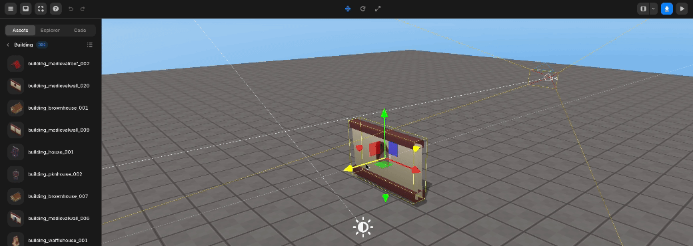
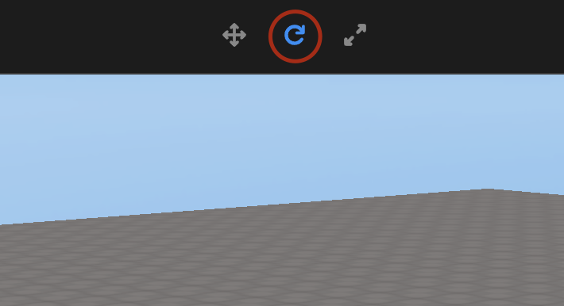

import { Callout } from "nextra/components";

# 객체 설정

> 객체를 이동, 회전, 크기 조절하는 방법에 대한 지침을 제공합니다.

---

세계나 게임을 만드는 두 번째 단계는 가져온 객체를 이동, 회전, 크기 조절하여 원하는 위치에 원하는 크기로 배치하는 것입니다.

## 이동

재배치하려는 객체를 클릭하고 상단 메뉴에서 이동 버튼을 선택합니다.

<Callout type="info" emoji="ℹ️">
  이동 버튼을 클릭하지 않고 키보드 숫자 `[2]` 버튼을 눌러 메뉴를 선택할 수
  있습니다.
</Callout>

이동 버튼

이동하고 싶은 방향의 화살표를 잡고 원하는 방향으로 드래그합니다.

객체 이동

## 객체 회전

회전시키고 싶은 객체를 클릭하고 상단 메뉴에서 회전 버튼을 선택합니다.

<Callout type="info" emoji="ℹ️">
  회전 버튼을 클릭하지 않고 키보드 숫자 `[3]` 버튼을 눌러 메뉴를 선택할 수
  있습니다.
</Callout>

회전 버튼

원하는 회전 방향의 원을 잡고 돌립니다.

객체 회전

## 객체 크기 조절

크기를 조절하고 싶은 객체를 클릭하고 상단 메뉴에서 크기 조절 버튼을 선택합니다.

<Callout type="info" emoji="ℹ️">
  크기 조절 버튼을 클릭하지 않고 키보드 숫자 `[4]` 버튼을 눌러 메뉴를 선택할 수
  있습니다.
</Callout>

크기 조절 버튼

원하는 방향의 선을 잡고 늘이거나 줄이고 싶은 방향으로 당깁니다.

객체 크기 조절

