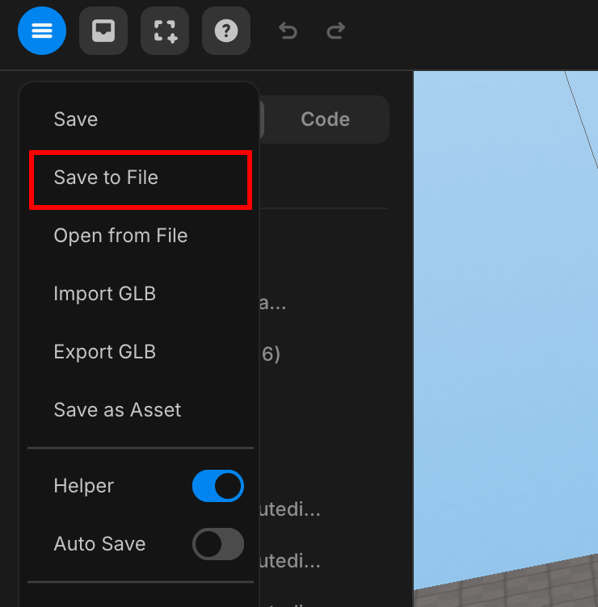

import { Callout } from "nextra/components";
import { Steps } from "nextra/components";

# 지원되지 않는 기능

현재 다음 기능은 지원되지 않습니다. 곧 추가될 수 있으니 기대해주세요! 😀

<Steps>

### 캐릭터 아바타 크기 조정

현재 캐릭터 아바타의 크기를 조절하는 기능은 제공되지 않습니다.

### GUI에서 GIF 사용

GIF를 추가하여 GUI로 사용할 수 없습니다.  
GUI의 형태를 변경할 수는 없지만 `tween` 또는 `move` 기능을 사용하여 GUI의 움직임을 제어할 수는 있습니다.

### 제어 키 사용자 지정

아바타의 제어 키를 'W, A, S, D, Space Bar' 이외의 다른 키로 변경할 수 없습니다.

### 코드 변경사항 기록

Git과 같은 형상관리, 또는 코드의 변경사항을 기록하는 기능은 없습니다.  
코드를 변경하기 전에 기존 코드를 보관하고 싶다면 기존 코드를 주석처리 하거나, 프로젝트를 파일로 저장하여 보관하세요.

```js showLineNumbers filename="기존 코드를 주석처리 하고 새로운 코드를 추가할 수 있습니다."
// 기존 코드 주석처리
// const score_board = GUI.getObject("score_board1");
// score_board.setText("100");


//새로운 코드
const score_board = GUI.getObject("score_board2");
score_board.setText("200");
```

<Callout type="info">
  현재 코드를 보관하고 싶다면 파일로 저장하여 컴퓨터에 보관할 수 있습니다.
  <br />
  <center> 상단 탭에서 File -> Save to File 클릭</center>
</Callout>

### 스크립트 위치 이동

스크립트창에 있는 스크립트의 순서를 바꾸는 기능은 현재 지원되지 않습니다. 

<Callout type="info">
  <center> 스크립트 창</center>
</Callout>

### 사용자 정의 글꼴 추가

레드브릭 엔진에 존재하는 글꼴 외에 새로운 글꼴을 추가하는 기능은 현재 지원되지 않습니다.

### GUI 호버(hover) 기능

GUI 위에 마우스가 올라가고 내려가는 것을 감지하는 호버(hover) 기능은 지원되지 않습니다.

### 스크립트 창을 닫은 후 Control + Z

스크립트 창 내부에서 Control + Z 사용이 가능하지만, 스크립트 창을 닫으면 그때까지의 코드 변경 기록은 초기화 됩니다.  

<Callout type="info">
  <center> 스크립트 창의 닫기 버튼</center>
</Callout>

</Steps>
