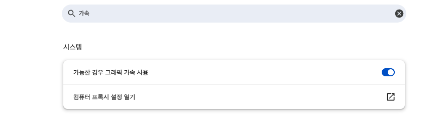
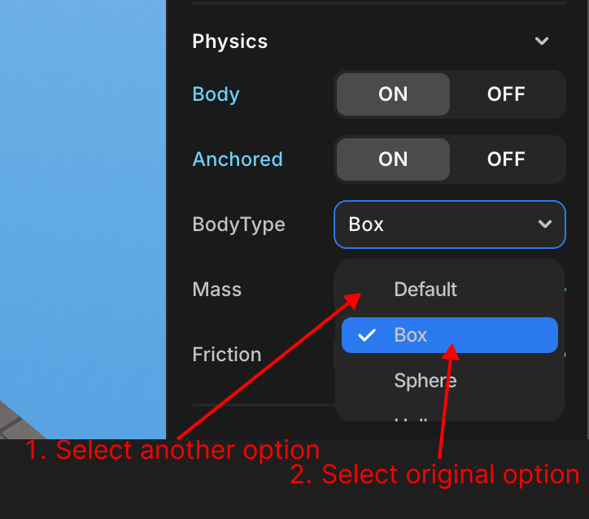
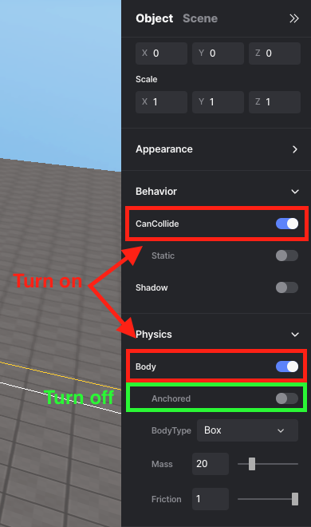

import { Callout } from "nextra/components";
import { Steps } from "nextra/components";
import { Tabs } from "nextra/components";

# 자주 묻는 질문

<Steps>

### 캐릭터가 느리고 버벅이거나, 공중부양 한다면

<Callout type="warning">
이 [링크](https://threejs.org/examples/#webgl_animation_keyframes)에 들어가서 애니메이션이 부드럽게 나오는지 확인해 주세요.  
만약 버벅인다면, 아래 내용을 따라주세요.  
</Callout>
<br/>

1. 크롬 설정 -> 검색에서 ‘가속’ 검색 -> 하드웨어 그래픽 가속 사용 체크 -> 크롬 다시시작
2. 그래도 안되면 캐시 삭제 후 모든 창 끄고 다시 켜주세요.  
3. 그래도 안되면 PC를 껐다 켜주세요  
4. 그래도 안되면 크롬 삭제 후 재설치 부탁드립니다.  

<Callout type="info">
  <br/>
  <center>
    크롬에서 그래픽 가속 사용
  </center>
</Callout>

<Callout type="error">
그래도 안될 경우  
컴퓨터에 그래픽 드라이버가 설치되어 있지 않거나, 업데이트가 되어있지 않다면 버벅거릴수 있습니다.  
그래픽 드라이버 유무를 확인해 주시고, 이미 설치되어 있다면 업데이트를 확인해 주세요.  
</Callout>

### 화면 크기가 달라지면 GUI가 제대로 나오지 않아요

GUI 오브젝트의 사이즈와 오프셋 속성을 px로 설정하셨나요?  
[이곳](../script/start/percent-and-px-unit.mdx)에서 px과 % 단위에 대해 알아보세요.  

### `.onCollide()`가 작동하지 않는 이유는 무엇인가요?

**Physics Body를 켰는지 확인하세요**

<Callout type="error" icon="‼️">
  `onCollide`와 같은 메서드를 사용하려면 객체의 속성 패널에서 Body를 체크하는
  것을 잊지 마세요!
  <div style={{ textAlign: "center" }}>
    <center>
       Physics > Body
    </center>
  </div>
  <br/>
  <br/>
  그래도 작동하지 않는다면, 오브젝트의 Physics -> Body -> BodyType을 다른 옵션으로 바꾼 후, 다시 원래 옵션으로 선택한 후 테스트해주세요.  
  <br/>
  <center>
    
  </center>
</Callout>

### 스크립트 이름을 어떻게 변경하나요?

**코드 패널에서 편집**

<Callout type="info">
  왼쪽의 코드 패널에서 스크립트를 **추가/편집/삭제**할 수 있습니다. 스크립트의
  이름도 변경할 수 있습니다.
  <br />
  <center> 이름 변경 </center>
</Callout>

### 재시작 기능을 어떻게 만드나요?

현재 레드브릭 스튜디오에서 게임을 재시작 또는 초기화 해주는 기능은 따로 없습니다.  
그러나 사용자 정의 함수로 비슷한 효과를 낼 수 있습니다.  
자세한 내용은 [이곳](../snippet/create-functionality-reset-game.mdx)을 참고하세요

### 게임을 일시정지하는 기능을 어떻게 만드나요?

현재 레드브릭 스튜디오에서 게임을 일시정지해주는 기능은 따로 없습니다.  
그러나 사용자 정의 함수로 비슷한 효과를 낼 수 있습니다.  
자세한 내용은 [이곳](../snippet/create-functionality-pause-game.mdx)을 참고하세요

### 오브젝트의 위치, 회전 값을 변경했는데 적용되지 않아요

Physics body가 켜져있는지 확인하세요.

<Callout type="info">
  <div style={{ textAlign: "center" }}>
    <center>
       Physics -> Body
    </center>
  </div>
  **Physics body가 켜진 상태**에서 객체의 위치나 회전 값이 변경될 때, 변경 값을 즉시 적용하고 싶다면 
  `body.needUpdate`를 사용하세요.
</Callout>
<Callout type="warning">
  Physics body가 **꺼진 상태**라면 이 작업이 필요하지 않습니다.
</Callout>

```js showLineNumbers {9}
const trash = WORLD.getObject("trash");

function Start() {
  trash.onCollide(avatar, handleTrashCollision);
}

function Update(dt) {
  if (trash.body) {
    trash.body.needUpdate = true; //needUpdate를 사용해 위치나 회전 값의 변경을 즉시 적용
  }
}
```

### 배경색을 어떻게 변경하나요?

프로젝트의 배경색을 변경하려면 `WORLD.background` 속성과 [Three.js](https://threejs.org/docs/index.html?q=color#api/en/math/Color)의 THREE.Color() 함수를 사용하면 쉽게 할 수 있습니다. 아래에 다양한 색상 지정 방법이 나와 있습니다.

<Callout type="info">
  아래에 나열된 방법 중 하나를 선택하여 배경색을 설정하세요.
</Callout>

```js showLineNumbers filename="Background change"
// 16진수 색상 (권장)
WORLD.background = new THREE.Color(0xff0000);

// RGB 문자열
WORLD.background = new THREE.Color("rgb(255, 0, 0)");
WORLD.background = new THREE.Color("rgb(100%, 0%, 0%)");

// X11 색상 이름 - 140개의 모든 색상 이름이 지원됩니다.
// 이름에 CamelCase가 없습니다
WORLD.background = new THREE.Color("skyblue");

// HSL 문자열
WORLD.background = new THREE.Color("hsl(0, 100%, 50%)");

// 0에서 1 사이의 개별 RGB 값
WORLD.background = new THREE.Color(1, 0, 0);
```

### 아바타의 점프 높이를 어떻게 변경하나요?

아바타 또는 플레이어의 점프 높이를 변경하려면 [`PLAYER.changePlayerJumpHeight(height)`](../script/api/avatar#changePlayerJumpHeight) 를 사용하세요. 기본 점프 높이는 3으로 설정되어 있습니다.

### 1인칭 시점으로 어떻게 전환하나요?

1인칭 시점으로 전환하려면 [`camera.useFPS()`](../script/api/perspective-camera#usefps)를 사용하세요. 3인칭 시점으로 다시 전환하려면 [`camera.useTPV()`](../script/api/perspective-camera#usetpv)를 사용하세요.  
단, `.useFPS()`와 `useTPV()`는  아바타에 [`.setFollowingCamera()`](../script/api/avatar#setfollowingcamera) 메소드가 적용되어 있어야 작동합니다.  
카메라에 대한 자세한 내용은 [이곳](../script/built-in/three/perspective)을 참고하세요.

### 이 오류는 무엇을 의미하나요?

- **TypeError**: 이 오류는 부적절한 타입의 값에 대해 연산을 수행할 때 발생합니다. 예를 들어, 숫자가 아닌 문자열에 대해 수학적 연산을 시도하면 `TypeError`가 발생합니다.

- **SyntaxError**: 이 오류는 코드에 잘못된 구문이 포함되어 있을 때 발생합니다. 괄호가 없거나, 중괄호가 맞지 않거나, 잘못된 들여쓰기 등의 코드 구조에 오류가 있어 코드가 올바르게 파싱되지 않음을 의미합니다.

### 움직이는 오브젝트위에 있는 아바타가 오브젝트와 같이 이동하지 않아요

움직이고 있는 오브젝트가 있고 아바타가 그 오브젝트를 밟고 있을 때, 아바타도 같이 움직이게 하려면 [`.changeAxisSpeed(x, y, z)`](../script/api/avatar#changeaxisspeed) 함수를 사용하세요.  
이 함수는 아바타의 x, y, z 축 방향으로의 이동 속도를 설정할 수 있습니다.

### 카메라 속성 변경이 작동하지 않는 이유는 무엇인가요?

스크립트 내에서 코드를 통해 카메라의 속성(`.fov`, `.far`, `.near`)을 변경하셨다면, 반드시 [`.updateProjectionMatrix()`](../script/built-in/three/perspective#updateprojectionmatrix)를 사용해야 변경된 값이 즉시 적용됩니다.  

### 카메라는 어떻게 변경하나요?

[`.activate()`](../script/api/perspective-camera#activate)를 통해 간단히 변경할 수 있습니다.  
카메라 1에서 카메라 2로 전환하려면 `camera2.activate()` 명령을 사용하세요.  
다른 카메라로 전환하려면 `otherCamera.activate()`를 사용하세요.

### GUI 이미지 없이 텍스트만 나오게 하고 싶어요

두가지 방법이 있습니다.  

<Callout type="info">
  방법1  
  <div style={{ textAlign: "center" }}>
    <center>
       GUI 객체의 속성 패널 -> Appearance -> Transparency  
      GUI 객체의 속성 패널 -> Text -> TextInput
    </center>
  </div>
  아무런 GUI나 생성한 뒤, Transparency 값을 0으로 조절해 투명하게 만듭니다.  
  이후 텍스트를 입력하면 GUI의 이미지는 보이지 않고 텍스트만 보이게 됩니다.  
</Callout>

<Callout type="info">
  방법2  
  <div style={{ textAlign: "center" }}>
    <center>
       좌측 패널 -> My -> 투명한 PNG파일 업로드 -> Add to GUI
    </center>
  </div>
  투명한 PNG 파일을 업로드 한 후, 텍스트를 입력하여 사용합니다.  
  사용자 파일 업로드 방법은 [이곳](../engine/operate/top.mdx)을 참고하세요.
</Callout>

### 다른 스크립트에서 선언한 변수, 함수를 가져와 사용하고 싶어요

[GLOBAL](../script/start/global-objects#global)을 이용하세요.

GLOBAL을 이용했는데도 다른 스크립트의 변수, 함수를 가져올 수 없나요?  
[코드 실행 흐름](../script/start/flow-control)에 유의하며 코딩했는지 확인해 보세요.

### 스튜디오 내의 에셋, 이미지 외에 저의 파일들을 추가해 사용하고 싶어요

My 에셋을 활용하세요.  
사용법은 [이곳](../engine/operate/top.mdx)을 참고하세요.  

### 플레이어, 오브젝트의 위치를 이동시키고 싶어요

[이곳](../script/start/absolute-and-relative-coordinates.mdx)의 내용을 참고하세요.

### 게임 플레이 중 씬의 Fog 값을 수정하고 싶어요

`WORLD.fog.density` 속성을 조절하여 간단하게 바꿀 수 있습니다.  

```js copy showLineNumbers filename="EX_fog_change"
let fogDensity = 0.01; // 초기 안개 밀도
const fogDensityIncreaseRate = 0.001; // 시간당 안개 밀도 증가율

function update(dt) {
    fogDensity += fogDensityIncreaseRate * dt; // 시간에 따라 안개 밀도 증가
    WORLD.fog.density = fogDensity; // 업데이트된 밀도로 안개 설정
}
```

### 아바타의 모습을 변경하고 싶어요

[레드브릭 홈페이지](https://redbrick.land/setting-avatar)에서 아바타의 모습을 변경하여 플레이 할 때의 모습을 바꿀 수 있습니다.  

만약 게임 플레이 도중에 아바타의 모습을 바꾸고 싶다면 이 [스니펫](../snippet/change-avatar-appearance.mdx)를 참고하세요.

### 맵을 import 할 수 있나요?

[My에셋](../engine/operate/top.mdx)에서 glb, gltf 형식의 에셋을 import 가능합니다.  
그러나 맵을 통째로 import하고 싶다면 맵 자체가 하나의 파일로 이루어져 있어야 합니다.  

### 오브젝트에 중력, 물리력을 적용하고 싶어요

<center>
<br/>

</center>

해당 오브젝트의 속성창에서 Behavior -> CanCollide 속성과 Physics -> Body 속성을 활성화 해주세요.  
그리고 Physics -> Body -> Anchored 속성은 비활성화 해주세요.  

<center>
<br/>
속성창
</center>

### Mesh의 색깔을 변경하고 싶어요

`MeshOjbect.material.color.set(0xff0000)` 를 이용해 간단히 변경할 수 있습니다.  

</Steps>
