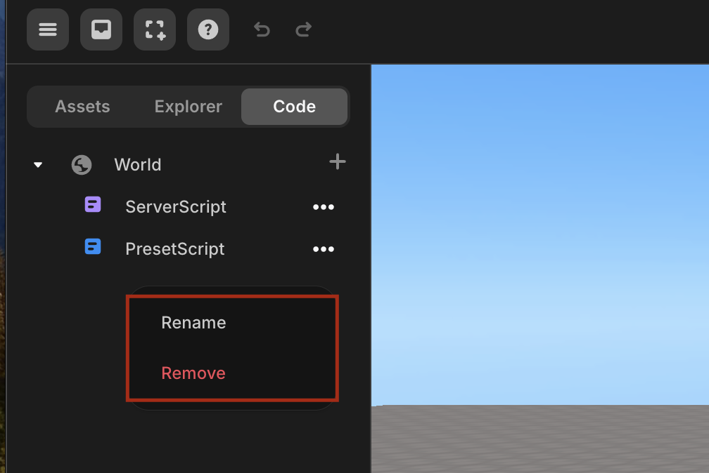

import { Callout } from "nextra/components";
import { Steps } from "nextra/components";
import { Tabs } from "nextra/components";

# 자주 묻는 질문

<Steps>
### `.onCollide()`가 작동하지 않는 이유는 무엇인가요?

**onCollide를 켰는지 확인하세요**

<Callout type="error" icon="‼️">
  `onCollide`와 같은 메서드를 사용하려면 객체의 속성 패널에서 Body를 체크하는
  것을 잊지 마세요!
  <div style={{ textAlign: "center" }}>
    <center>
       Physics -> Body
    </center>
  </div>
</Callout>

### 스크립트 이름을 어떻게 변경하나요?

**속성 패널에서 편집**

<Callout type="info">
  객체의 속성 패널에서 스크립트를 **추가/편집/삭제**할 수 있습니다. 스크립트의
  이름도 변경할 수 있습니다.
  <br />
  <center> 이름 변경 </center>
</Callout>

### 재시도 버튼을 어떻게 만드나요?

게임이 시작될 때 모든 초기화 코드를 넣는 초기화 함수를 생성하세요. 그리고 게임을 재시작할 때마다 이 함수를 사용하세요.

```js showLineNumbers filename="example restart" {5, 7-12, 18-20}
let score = 0;
const scoreGUI = GUI.getObject("score_gui");

const startButton = GUI.getObject("start_button");
const restartButton = GUI.getObject("restart_button");

function gameStart() {
  PLAYER.spawn();
  score = 0;
  scoreGUI.setText = score;
  // 초기화/설정이 필요한 다른 부분들
}

startButton.onClick(() => {
  gameStart(); // 시작
});

restartButton.onClick(() => {
  gameStart(); // 모든 값을 재설정
});
```

### Why isn't my object moving?

<Callout type="info">
  **켜진 상태**에서 객체의 위치가 변경될 때마다 Physics body를 업데이트하려면
  `body.needUpdate`를 사용하세요.
</Callout>
<Callout type="warning">
  Physics body가 **꺼진 상태**라면 이 작업이 필요하지 않습니다.
</Callout>

```js showLineNumbers {9}
const trash = WORLD.getObject("trash");

function Start() {
  trash.onCollide(avatar, handleTrashCollision);
}

function Update(dt) {
  if (trash.body) {
    trash.body.needUpdate = true;
  }
}
```

### 배경색을 어떻게 변경하나요?

프로젝트의 배경색을 변경하려면 `WORLD.background` 속성과 [Three.js](https://threejs.org/docs/index.html?q=color#api/en/math/Color)의 THREE.Color() 함수를 사용하면 쉽게 할 수 있습니다. 아래에 다양한 색상 지정 방법이 나와 있습니다.

<Callout type="info">
  아래에 나열된 방법 중 하나를 선택하여 배경색을 설정하세요.
</Callout>

```js showLineNumbers filename="Background change"
// 16진수 색상 (권장)
WORLD.background = new THREE.Color(0xff0000);

// RGB 문자열
WORLD.background = new THREE.Color("rgb(255, 0, 0)");
WORLD.background = new THREE.Color("rgb(100%, 0%, 0%)");

// X11 색상 이름 - 140개의 모든 색상 이름이 지원됩니다.
// 이름에 CamelCase가 없습니다
WORLD.background = new THREE.Color("skyblue");

// HSL 문자열
WORLD.background = new THREE.Color("hsl(0, 100%, 50%)");

// 0에서 1 사이의 개별 RGB 값
WORLD.background = new THREE.Color(1, 0, 0);
```

### 아바타의 점프 높이를 어떻게 변경하나요?

아바타 또는 플레이어의 점프 높이를 변경하려면 PLAYER.changePlayerJumpHeight(3)를 사용하세요. 기본 점프 높이는 3으로 설정되어 있습니다.

### 캐릭터 크기를 어떻게 줄이나요?

현재 이 기능은 지원되지 않습니다. 곧 추가될 예정이니 기대해 주세요. 😀

### 1인칭 시점으로 어떻게 전환하나요?

1인칭 시점으로 전환하려면 `camera.useFPS()`를 사용하세요. 3인칭 시점으로 다시 전환하려면 `camera.useTPV()`를 사용하세요.

### 이 오류는 무엇을 의미하나요?

- **TypeError**: 이 오류는 부적절한 타입의 값에 대해 연산을 수행할 때 발생합니다. 예를 들어, 숫자가 아닌 문자열에 대해 수학적 연산을 시도하면 `TypeError`가 발생합니다.

- **SyntaxError**: 이 오류는 코드에 잘못된 구문이 포함되어 있을 때 발생합니다. 괄호가 없거나, 중괄호가 맞지 않거나, 잘못된 들여쓰기 등의 코드 구조에 오류가 있어 코드가 올바르게 파싱되지 않음을 의미합니다.

### 아바타를 어떻게 움직이나요?

아바타가 밟고 있는 이동하는 객체와 함께 움직이게 하려면 `.changeAxisSpeed(x, y, z)` 함수를 사용하세요. 이 함수는 아바타의 x, y, z 축 방향으로의 이동 속도를 설정할 수 있습니다.

### 카메라 속성 변경이 작동하지 않는 이유는 무엇인가요?

카메라 투영 행렬을 업데이트합니다. 매개변수(`.fov`, `.far`, `.near`)가 변경된 후에는 반드시 호출해야 합니다.

### 카메라는 어떻게 변경하나요?

카메라 1에서 카메라 2로 전환하려면 간단히 `camera2.activate()` 명령을 사용하세요. 다른 카메라로 전환하려면 `otherCamera.activate()`를 사용하세요.

### 텍스트만 표시하려면 어떻게 하나요?

보이지 않는 GUI를 생성한 다음 setText를 설정할 수 있습니다

</Steps>
