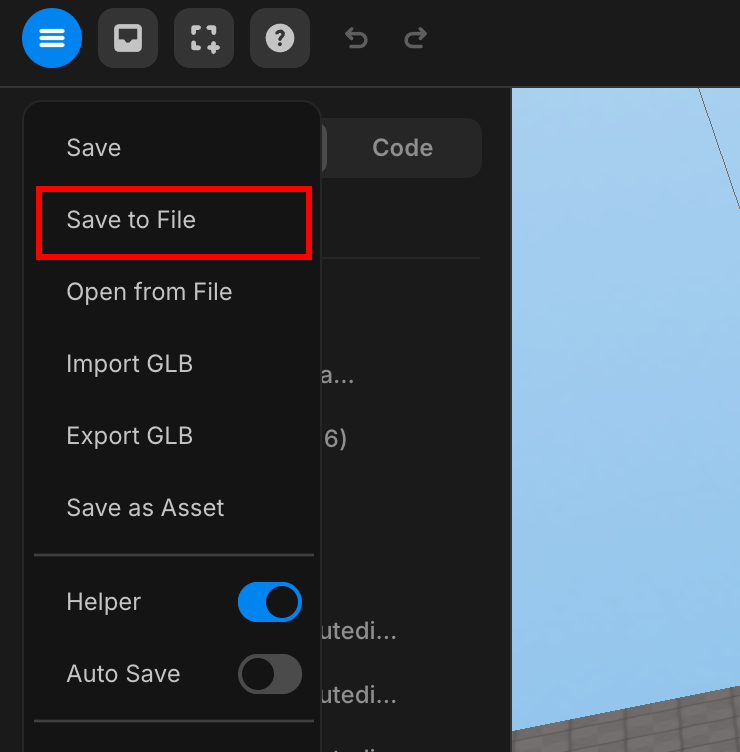
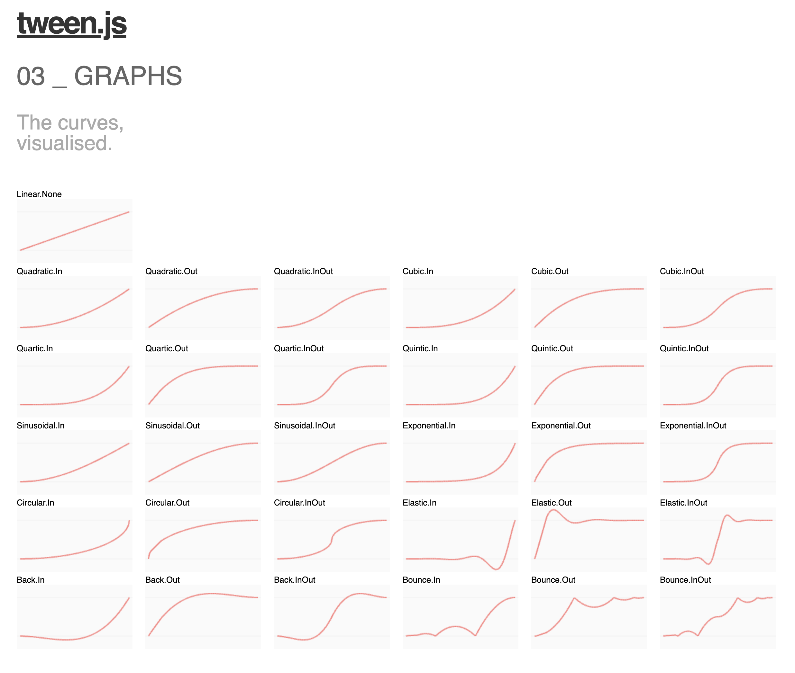

import { Callout } from "nextra/components";
import { Steps } from "nextra/components";
import { Tabs } from "nextra/components";

# 팁과 요령

<Steps>

### 중요한 변경 사항이 있을 때마다 파일로 저장하세요

<Callout type="error">
  _프로젝트를 잃지 않고 진행 상황을 추적하기 위해 중요한 변경 사항이 있을 때마다
  파일로 저장하는 것이 좋습니다. 이러한 파일을 로컬 컴퓨터에 보관하세요._
  <br />
  <center> Save as file</center>
</Callout>

<Callout type="information">

- 이 방법을 사용하면 이전 버전에 쉽게 접근하고 필요할 경우 이전 코드를 복구할 수 있습니다.

- 특히 인터넷 연결이 불안정할 경우에 중요합니다.

</Callout>

### 스튜디오 자산 라이브러리의 자산을 사용하세요

_지연을 방지하고 잠재적인 문제를 예방하기 위해 스튜디오 자산 라이브러리의 자산을 사용하는 것이 좋습니다. 손상되거나 손상된 3D 자산을 사용하면 문제가 발생하고 프로젝트가 망가질 수 있습니다._

<Callout>

따라서 가능한 경우 스튜디오 자산 라이브러리의 자산을 사용하거나 경량의 간단한 3D 자산을 선택하세요.

</Callout>

### 애니메이션 트릭

_고품질 결과를 얻기 위해 매끄러운 애니메이션에는 Tween을 사용하는 것이 좋습니다._

```js showLineNumbers filename="Animation"
const start = { y: 0 }; // 초기 Y 위치
const end = { y: 2 }; // 최종 Y 위치

const tween = new TWEEN.Tween(start)
    .to(end, 100) // 지속 시간 설정
    .onUpdate(() => {
        object.position.y = start.y; // 객체의 Y 위치 업데이트
    })
    .easing(TWEEN.Easing.Quadratic.InOut) // 부드러운 전환을 위한 easing 적용
    .repeat(Infinity) // 무한 반복
    .yoyo(true); // 각 사이클에서 애니메이션 반전
    .start(); // 애니메이션 시작
```

<Callout type="info">
  트윈 이징 시각화 그래프
  <br />
  <div style={{ textAlign: "center" }}>
    <center> 트윈 이징 그래프</center>
  </div>
</Callout>

### 편집 모드에서 카메라 움직임 변경

기본 궤도 카메라 움직임이 어렵다고 느껴지면, `9` 키를 눌러서 전환할 수 있습니다.

<Callout type="warning">
  `9` 키를 다시 누르면 카메라가 느리게 움직일 것입니다. 한 번 더 누르면 정상
  속도로 돌아갑니다.
</Callout>

<Callout type="info">
  또한, 카메라를 움직이는 동안 `Shift` 키를 누르면 카메라 이동 속도가
  빨라집니다.
</Callout>

</Steps>
