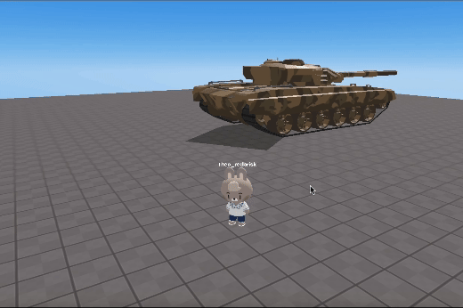
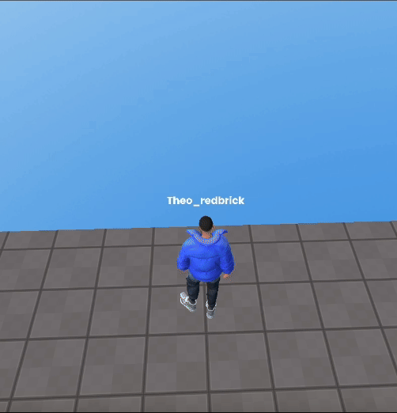

import { Steps, Callout } from "nextra/components";

## 업데이트

### 업데이트 날짜: `2024/07/24`

#### 추가 사항

- [`.useTPV()`](../script/api/perspective-camera#usetpv) 메소드에 "MOUSE_LOCK" 모드 추가  
  3인칭 시점을 설정해주는 메소드 `useTPV()`에 "MOUSE_LOCK" 모드가 추가되었습니다.  
  이 모드는 아래 사진과 같이 마우스를 움직이는 것 만으로 카메라를 회전할 수 있습니다.  
  또한 이 모드를 사용하면 카메라 세팅을 커스터마이징 할 수 있습니다.  

  <Callout type="info">
  NORMAL 모드와 MOUSE_LOCK 모드  
  <br/>
  | NORMAL | MOUSE_LOCK |
  |:------------------:|:---------------------:|
  |  |  |
  </Callout>
<br/>

- RPM 아바타에 떨어질 떄의 애니메이션이 추가되었습니다.
<br/>
<center>
    
</center>
<br/>

- 스크립트 편집기에 코드 정렬기능이 추가되었습니다.
<br/>
<center>
  
</center>

- 위키에 다양한 [스니펫 예제](../snippet/management-multiple-similar-objects.mdx)들이 추가되었습니다.

### 업데이트 날짜: `2024/05/30`

<Steps>

#### 추가 사항

- 플레이어 점프 높이 제어 기능 [`.changePlayerJumpHeight`](../script/api/avatar#changeplayerjumpheight) 추가
- 내장 메서드 [`.cloneWithMethods()`](../script/api/object3d#clonewithmethods)를 사용하여 객체를 쉽게 복제할 수 있는 클론 기능이 추가
- 카메라
  - 카메라 전환 API [`.activate()`](../script/api/perspective-camera#activate) 추가, 이를 통해 해당 카메라를 자동으로 활성화하고 다른 모든 카메라를 비활성화할 수 있습니다.
  - 1인칭 시점으로 전환하는 카메라 API [`.useFPS()`](../script/api/perspective-camera#usefps) 추가
  - 3인칭 시점으로 전환하는 카메라 API [`.useTPV()`](../script/api/perspective-camera#usetpv) 추가
  - VR 모드로 전환하는 카메라 API [`.useVR({ VRObject: PLAYER })`](../script/api/perspective-camera#usevr) 추가
- OOBC
  - OOBC 부활 기능 추가
  - OOBC GUI 제어 추가 (죽이기, 부활, 이동 등)
  - GUI에 텍스트 설정 기능 `setText` 추가
  - OOBC를 위한 스프라이트 썸네일 지원 추가

#### 개선 사항

- 현재 활성화된 카메라를 올바르게 추적하도록 아바타의 닉네임 스프라이트 조정
- 현재 활성화된 카메라를 따라 정확하게 이동하도록 아바타의 WASD 이동 수정
- 마우스 문제를 방지하기 위해 궤도 제어의 최대 및 최소 범위를 제한
- 코드 편집기 자동 완성 기능 수정
- AI Assistant (GPT) UI 업데이트

</Steps>

## 버전 1.1.1 `최근`

- `2024/01/25`에 출시됨

<Steps>
### Additions

#### 전역 객체

- [`PLAYER` 전역 객체](../script/start/global-objects#player)에 대한 문서 추가
- [`GLOBAL` 전역 객체](../script/start/global-objects#global)에 대한 문서 추가

### Changes

자세한 정보는 [여기](../engine/content-type)를 클릭하세요

#### 프리셋 스크립트에서 `async` 함수 제거.

```jsx copy filename="new Preset Script"
const avatar = REDBRICK.AvatarManager.createDefaultAvatar();
const camera = WORLD.getObject("MainCamera");
const followingCamera = avatar.setFollowingCamera(camera);
avatar.setDefaultController();
```

</Steps>

## 버전 1.1.0

<Steps>

### 제거됨

#### 전역 객체

`PLAYER` 전역 객체 제거

### Changes

프리셋 스크립트를 업데이트하여 async 함수 제거.

```jsx copy filename="version1.1.0 Preset Script"
function Start() {
  (async () => {
    const avatar = await REDBRICK.AvatarManager.createDefaultAvatar();
    const camera = WORLD.getObject("MainCamera");
    const followingCamera = avatar.setFollowingCamera(camera);
    avatar.setDefaultController();
  })();
}
```

</Steps>
