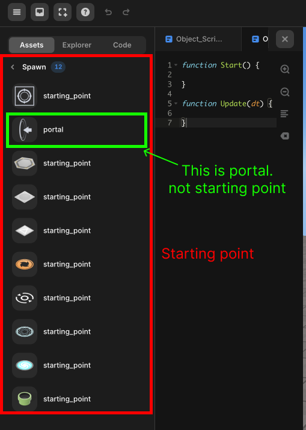

import { Callout } from "nextra/components";

# Avatar

> 플레이어의 아바타에 추가되는 API.

플레이어 (아바타) 오브젝트도 Object3D를 상속받기 때문에 [Object3D](../built-in/three/object3d.mdx)의 속성과 메소드를 사용할 수 있습니다.  

## 메소드

### .spawn()

`.spawn(target) `

- target : 객체 또는 객체의 이름. 해당 객체의 위치로 스폰합니다. 기본값은 `StartLocation`입니다.

아바타를 지정한 위치로 이동시킵니다.  
target을 지정하지 않으면 `starting_point`로 이동합니다.

<Callout type="warning">
`starting_point`로 이동하기 위해선 씬 내에 `starting_point` 에셋이 존재해야 합니다.  
 

</Callout>

### .changePlayerSpeed()

`.changePlayerSpeed(speed) `

아바타의 속도를 변경합니다.

- speed : 아바타의 속도, 기본값은 1입니다.

### .changeAxisSpeed()

`.changeAxisSpeed(x, y, z) `

플레이어 컨트롤에 영향을 받지 않는 독립적인 기본 속도를 아바타에 부여합니다.

- x : x축 방향으로의 초당(sec) 속도.
- y : y축 방향으로의 초당(sec) 속도.
- z : z축 방향으로의 초당(sec) 속도.

### .changePlayerJumpHeight()

`.changePlayerJumpHeight(height) `

아바타의 점프 높이를 변경합니다.

- height : 아바타의 점프 높이, 기본값은 3입니다.

### .setDefaultController()

`.setDefaultController `  

아바타에 기본 컨트롤러를 적용해 제어합니다.  
이 메소드를 사용하면 `W, A, S, D, Space Bar`로 아바타 움직임을 제어할 수 있게됩니다.  

### .setFollowingCamera()

`.setFollowingCamera(camera) ` : [PerspectiveCamera](../built-in/three/perspective.mdx)  

camera가 해당 아바타를 자동으로 따라다니게 합니다.  

- camera : 아바타를 따라다니게 할 [Perspective Camera](../../script/built-in/three/perspective.mdx) 객체입니다.