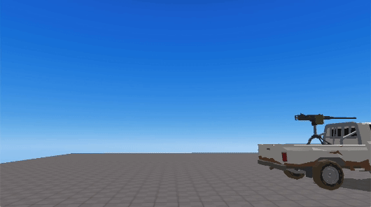

import { Callout } from "nextra/components";

# Perspective Camera

> 카메라 객체에 추가되는 API들.

## 메소드

### .activate()

해당 카메라로 전환합니다.  

### .useFPS()

`.useFPS () ` : undefined

카메라를 FPS 모드(1인칭)로 설정합니다.

<br/>
<center>
 1인칭 화면
</center>

### .useTPV()

`.useTPV (mode, setting) ` : undefined

카메라를 3인칭 모드로 설정합니다.  

- **mode**: 3인칭 시점의 모드를 설정합니다. 기본값은 "NORMAL_MODE"입니다.
  - **"NORMAL_MODE"**: 기본적인 3인칭 시점의 모드입니다. 카메라를 회전시키려면 마우스로 화면을 드래그 해야합니다.
  - **"MOUSE_LOCK"**: 드래그 없이, 마우스를 움직이는 것 만으로 카메라를 회전시킬 수 있습니다.   
<br/>
- **setting**: "MOUSE_LOCK" 모드일 때, 카메라의 파라미터를 설정하는 객체입니다. 값을 설정하지 않으면 기본값으로 적용됩니다.
  - **bottomClamp**: 카메라의 피치(pitch) 각도를 제한하는 하한값입니다. 기본값은 -15도로, 카메라가 아래로 얼마나 내려갈 수 있는지를 결정합니다. 최소값은 -90입니다.
  - **topClamp**: 카메라의 피치(pitch) 각도를 제한하는 상한값입니다. 기본값은 70도로, 카메라가 위로 얼마나 올라갈 수 있는지를 결정합니다. 최대값은 90입니다.
  - **sensitivityX**: 마우스 움직임에 따른 카메라의 수평 회전 민감도입니다. 기본값은 0.05입니다.
  - **sensitivityY**: 마우스 움직임에 따른 카메라의 수직 회전 민감도입니다. 기본값은 0.05입니다.
  - **cameraOffset**: 카메라가 회전할 때 기준이 되는 중심점의 위치를 설정하는 객체입니다. 아바타를 기준으로 이 값만큼 떨어진 곳을 중심점으로 삼게 됩니다.
    - **x**: x축 오프셋입니다. 기본값은 0입니다.
    - **y**: y축 오프셋입니다. 기본값은 5입니다.
    - **z**: z축 오프셋입니다. 기본값은 3입니다.
  - **distance**: 설정된 cameraOffset 지점과 카메라의 거리입니다. 카메라가 회전 중심점으로부터 얼마나 떨어져 있을지를 결정합니다.
  - **zoom**: 카메라 줌 설정을 위한 객체입니다.
    - **scrollLock**: 마우스 휠을 사용해 distance를 유동적으로 변경할 수 있게 하는 줌 기능의 활성화 여부입니다. 기본값은 true로, 마우스 휠을 사용한 줌이 비활성화됩니다.
    - **minDistance**: 줌할 수 있는 최소 거리입니다. 기본값은 5입니다.
    - **maxDistance**: 줌할 수 있는 최대 거리입니다. 기본값은 15입니다.
  - **lookAtPoint**: 카메라가 바라볼 지점을 설정하는 객체입니다.
    - **target**: 카메라가 바라볼 대상입니다. 기본값은 "CAMERA_TARGET"입니다.
      - **"CAMERA_TARGET"**: 카메라가 cameraOffset 지점을 바라보게 합니다.
      - **"AVATAR"**: 카메라가 아바타를 바라보게 합니다.
    - **x**: target의 x축에서 해당 값만큼 떨어진 지점을 바라보게 합니다. 기본값은 0입니다.
    - **y**: target의 y축에서 해당 값만큼 떨어진 지점을 바라보게 합니다. 기본값은 0입니다.
    - **z**: target의 z축에서 해당 값만큼 떨어진 지점을 바라보게 합니다. 기본값은 0입니다.

<br/>

<center>
 "NORMAL_MODE" : 마우스로 화면을 클릭한 후 끌어서(드래그) 회전
<br/>
 "MOUSE_LOCK" : 마우스의 움직임만으로 회전
</center>


<Callout type="warning">
    `.useFPS()`와 `useTPV()`는  아바타에 `.setFollowingCamera()` 메소드가 적용되어 있어야 작동합니다.  
    
    Ex) 사용 예시
    ```js showLineNumbers copy filename="camera_customizing"
    const avatar = REDBRICK.AvatarManager.createDefaultAvatar();
    const camera = WORLD.getObject("MainCamera");
    const followingCamera = avatar.setFollowingCamera(camera); //아바타에 setFollowingCamera()가 적용되어 있어야 합니다.
    avatar.setDefaultController();

    //"MOUSE_LOCK" 모드 일 때, 다음과 같이 값을 커스터마이징 할 수 있습니다. 
    //설정하지 않은 값들은 기본값으로 세팅됩니다.
    camera.useTPV("MOUSE_LOCK", {
        distance : 20,
        cameraOffset : {
            z : 5,
            y : 7
        },
        sensitivityX : 0.2,
        topClamp : 90,
        zoom : {
            scrollLock : false
        }
    });
    ```
</Callout>

### .useVR()

`.useVR({ VRObject: object }) ` : undefined  

카메라를 VR모드로 설정합니다.  
VR 옵션에 대한 자세한 내용은 [이곳](../../engine/content-type#vr-option)을 참고하세요.  

- object : [Avatar](../api/avatar.mdx) 객체 또는 [Object3D](../built-in/three/object3d.mdx) 객체  