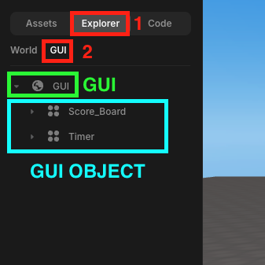
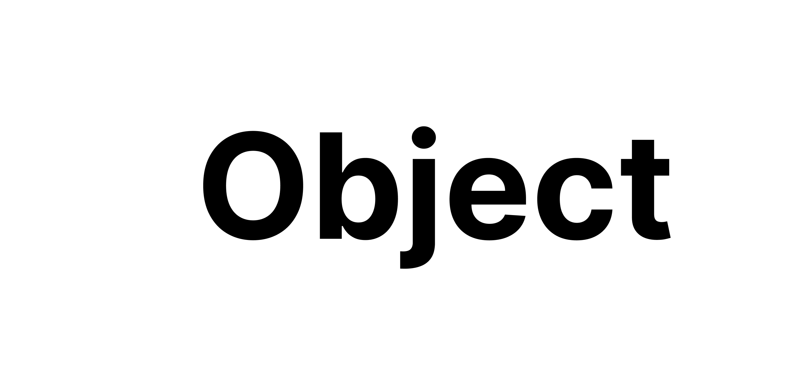
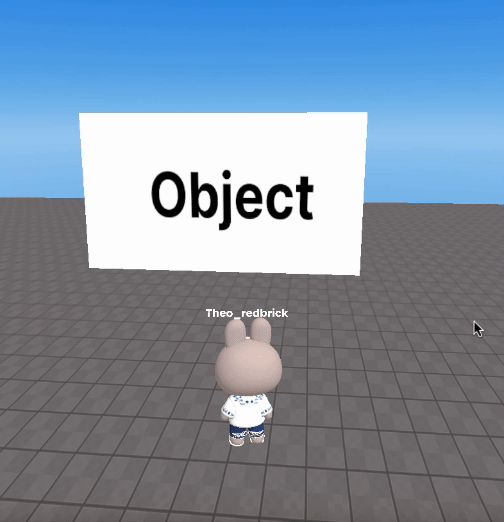
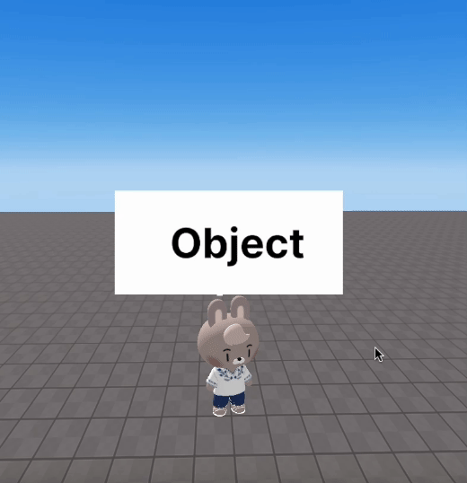

import { Callout } from "nextra/components";

# 3D & GUI 오브젝트

> 레드브릭 스튜디오의 3D 오브젝트와 GUI 오브젝트에 대해 안내합니다.

레드브릭 스튜디오에서 오브젝트는 3D 오브젝트와 GUI 오브젝트로 나뉩니다.  

## 3D Object

3D 오브젝트는 게임의 3D 공간 내에서 존재하는 오브젝트입니다.  
이러한 오브젝트는 3차원 속성을 가지며 서로 또는 환경과 상호작용할 수 있습니다.  
3D 오브젝트의 예시는 다음과 같습니다 :  
- 메시(Mesh): 큐브, 구, 그리고 3D 모델링 소프트웨어에서 생성된 커스텀 모델과 같은 형태들.
- 지형(Terrain): 풍경이나 지면 표면.
- 캐릭터(Character): 플레이어 또는 NPC 캐릭터 모델.
- 오브젝트(Object): 나무, 건물, 차량 등 다양한 환경 요소.

스튜디오 좌측 오브젝트 레이어 패널에서 3D 오브젝트와 GUI 오브젝트를 명확하게 구분할 수 있습니다.  
위측 패널에서 Explorer 탭을 선택한 다음, World 탭을 선택하면 씬 내에 있는 3D 오브젝트의 리스트가 나타납니다.  

 
오브젝트 레이어 World 탭

이때, 지구본 모양의 default 라고 쓰여있는 오브젝트가 WORLD 오브젝트 입니다.  
스크립트 내에서 `WORLD.getObject("object")`, `WORLD.add(object)` 와 같은 메소드를 사용할 때 쓰는 WORLD가 바로 이것을 뜻합니다.  

## GUI 오브젝트

GUI 오브젝트는 유니티에서 사용자 인터페이스를 구성하는 요소들입니다.  
사용자와의 상호작용을 위한 그래픽 요소를 의미합니다. GUI 오브젝트의 예시는 다음과 같습니다 :  
- 텍스트(Text): 화면에 표시되는 글자.
- 버튼(Button): 클릭 가능한 인터랙티브 요소.
- 이미지(Image): 화면에 표시되는 그래픽 또는 아이콘.

위측 패널에서 Explorer› 탭을 선택한 다음, GUI 탭을 선택하면 씬 내에 있는 GUI 오브젝트의 리스트가 나타납니다.  

 
오브젝트 레이어 GUI 탭

지구본 모양의 GUI 라고 쓰여있는 오브젝트가 GUI 오브젝트 입니다.  
스크립트 내에서 `GUI.getObject("object")`와 같은 메소드를 사용할 때 쓰는 GUI가 바로 이것을 뜻합니다. 

## 3D 오브젝트와 GUI 오브젝트의 차이

아래 이미지를 각각 3D 오브젝트와 GUI 오브젝트로써 씬에 추가해 보겠습니다.  

 
예시 이미지
 

### 3D 오브젝트

3D 오브젝트로 씬에 추가하면, 오브젝트는 WORLD의 자식으로 추가되며 3차원 공간에 렌더링 됩니다.  

 

 

### GUI 오브젝트

GUI 오브젝트로 씬에 추가하면, 오브젝트는 GUI의 자식으로 추가되며 2차원 공간에 렌더링 됩니다.  
또한, GUI 오브젝트는 플레이어가 카메라의 방향을 바꾸어도 시야에서 벗어나지 않습니다.  

 

 

