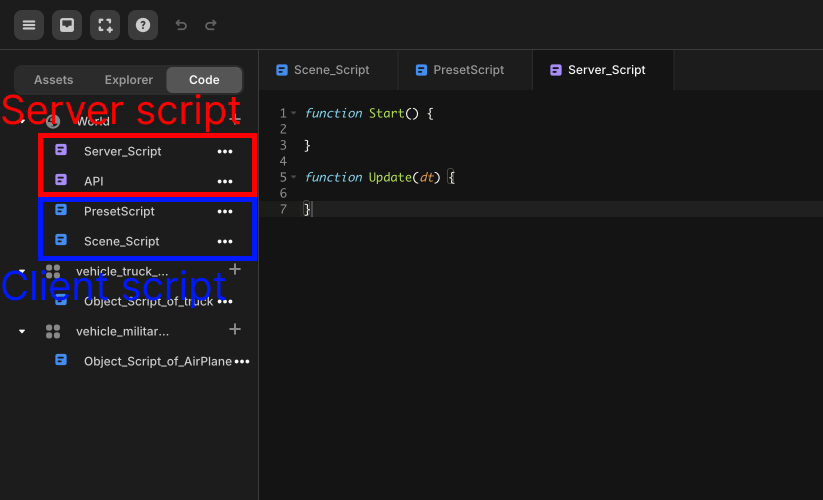

import { Callout } from "nextra/components";

# 클라이언트 & 서버 스크립트

> 클라이언트 스크립트와 서버 스크립트에 대해 안내합니다.

Client Script는 플레이어 개개인의 클라이언트에서 실행되고, Server Script는 멀티플레이 서버에서 실행됩니다. 멀티플레이로 제작하지 않는다면 Server Script는 작성하지 않고 Client Script만 작성합니다.

Client Script와 Server Script의 역할이 다른 만큼 스크립트 안에서 사용할 수 있는 Event Function이나 Global Object에도 차이가 있습니다.

<Callout type="info">
    아래 사진과 같이 서버 스크립트는 붉은색, 클라이언트 스크립트는 파란색으로 표시됩니다.  
     
    
</Callout>