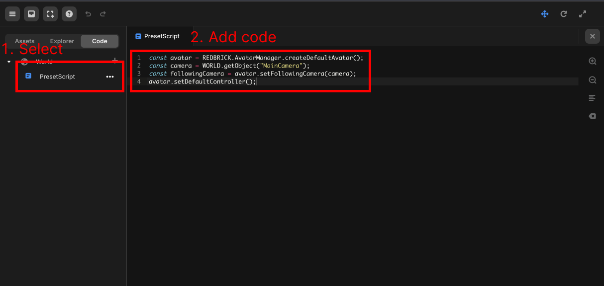

import { Callout } from "nextra/components";

# 아바타 & 카메라 기본 세팅

> 아바타와 카메라 기본 세팅에 대해 안내합니다.  

아바타와 카메라를 세부적으로 조정하지 않고 간단하게 사용하고 싶다면 다음을 따라주세요.  

프로젝트 생성 시, 기본적으로 생성되어 있는 `PresetScript` 스크립트에 다음 코드를 입력해주세요.  

```js copy showLineNumbers filename="PresetScript"
const camera = WORLD.getObject("MainCamera");
const avatar = REDBRICK.AvatarManager.createDefaultAvatar();
avatar.setDefaultController();
avatar.setFollowingCamera(camera);
```

<Callout type="info">
  <center></center>
</Callout>

이렇게 하면 카메라는 3인칭모드를 사용하고, 아바타는 레드브릭 홈페이지에서 설정한 아바타를 그대로 사용합니다.  
카메라의 속성, FPS모드, TPV모드 등 세부적인 설정을 확인하고 싶다면 [이곳](../built-in/three/perspective)을 참고해 주세요.