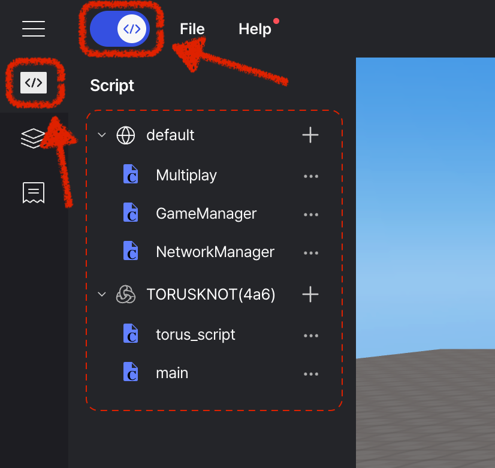

# Object Script

> 오브젝트 스크립트를 추가하고 사용하는 기본적인 방법에 대해 안내합니다.

오브젝트의 속성 창에서 스크립트를 추가 / 편집 / 삭제할 수 있습니다. 또한 스크립트의 이름을 변경할 수 있습니다.


스크립트 내부에서 `this` 키워드를 이용해 해당 스크립트가 작성된 오브젝트에 바로 접근할 수 있습니다.

```js showLineNumbers copy {2} filename="TORUSKNOT(4a6)/ScriptTitle"
function Start() {
  this.move(1, 1, 1); // this === WORLD.getObject("Cube");
}
```

우측 상단 메뉴의 스크립트 버튼을 클릭하면 모든 스크립트의 리스트를 확인할 수 있습니다.


