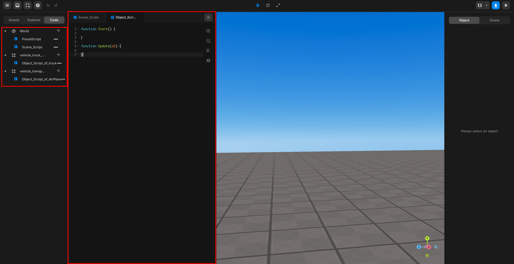

import { Callout } from "nextra/components";

# 오브젝트 & 씬 스크립트

> 레드브릭 스튜디오에서 스크립트의 종류는 크게 서버 스크립트와 클라이언트 스크립트로 나뉩니다.  
> 이 페이지에서는 클라이언트 스크립트의 두가지 종류에 대해 알아보겠습니다.  

싱글 플레이 게임을 제작한다면 여러분은 클라이언트 스크립트만 사용하게 될 것입니다.  
클라이언트 스크립트는 또다시 오브젝트 스크립트와 씬 스크립트로 나뉩니다.  
이들은 말그대로 각각 씬과 오브젝트에 연결된 스크립트를 말합니다.  

씬 스크립트를 사용한다면, 특정 오브젝트를 불러올 때 `getObject()`등의 방법을 사용해서 해당 오브젝트를 직접 지정해 주어야 합니다.  

```js showLineNumbers filename="씬 스크립트"
const score_board = GUI.getObject("score_board"); //어떤 오브젝트를 가져올지 직접 지정해 주어야 함
score_board.setText("100");
```

그러나 오브젝트 스크립트를 사용한다면, 스크립트 내부에서 `this` 키워드를 이용해 해당 스크립트가 작성된 오브젝트에 바로 접근할 수 있습니다.

```js showLineNumbers copy {2} filename="GUI 오브젝트 score_board의 오브젝트 스크립트"
this.setText("100"); //this를 이용해 해당 오브젝트에 바로 접근가능
```

<Callout type="info">
  아래 사진과 같이 우측 상단 메뉴의 Left버튼을 클릭한 후 좌측 상단의 code 버튼을 통해 모든 스크립트의 리스트를 확인할 수 있습니다.
  <br/>
  <center>
    
    <br/>
    
  </center>
  지구본 모양의 오브젝트(Scene)의 자식으로 있는 것이 씬 스크립트,  
  그 이외의 오브젝트의 자식으로 있는것이 오브젝트 스크립트입니다.
</Callout>

## 씬 스크립트

씬 스크립트는 전체 씬을 제어하고 관리하는 데 사용됩니다. 씬 내의 전반적인 로직과 흐름을 정의할 수 있습니다.  
보통 씬에 대한 초기화, 설정, 상호작용, 이벤트 처리 등과 같은 기능을 수행합니다.  
예를 들어, 특정 씬이 시작될 때 특정 오브젝트들을 배치하거나, 씬 내에서 발생하는 이벤트를 감지하고 처리하는 기능을 구현할 때 사용됩니다.  

```js copy showLineNumbers filename="EX_Scene_Script"
const timer = new REDBRICK.Timer();
const score = 0;

function game_start(){
  timer.reset();
  timer.start();
  score = 0;
}

function Start(){
  game_start();
  REDBRICK.Signal.addListener("score_operation", function(value) {
    score += value;
  })
}
```

## 오브젝트 스크립트

오브젝트 스크립트는 개별 오브젝트를 제어하고 관리하는 데 사용됩니다. 각 오브젝트마다 고유한 동작과 상호작용을 정의할 수 있습니다.  
예를들어 특정 오브젝트에 첨부되어 해당 오브젝트의 행동을 제어하거나, 오브젝트의 움직임, 애니메이션, 상호작용 등을 세밀하게 제어할 수 있습니다.  

```js showLineNumbers copy filename="EX_Object_Script"
function Start(){
  this.onCollide(PLAYER, function() {
    REDBRICK.Signal.send("score_operation", 1);
    this.kill();
  });
}
```
  
## 씬 & 오브젝트 스크립트 편집

<Callout type="info">
  속성 창에서 오브젝트 & 씬 스크립트를 추가 / 편집 / 삭제할 수 있습니다. 또한 스크립트의 이름을 변경할 수 있습니다.
  <br />
  <center></center>
  <br/>
  <center></center>
</Callout>