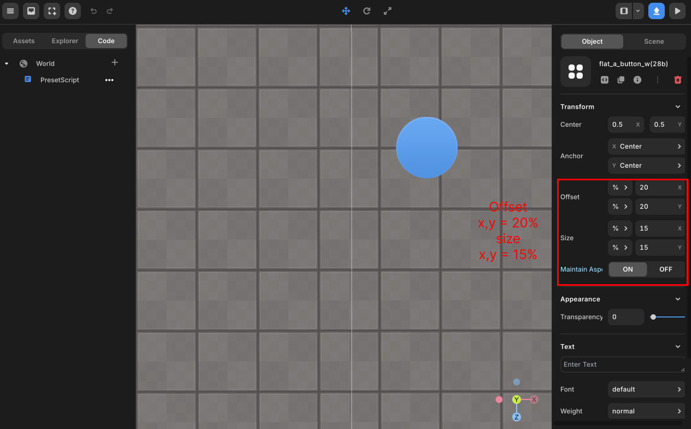

import { Callout } from "nextra/components";

# px과 % 단위

> % 와 px의 차이점에 대해 안내합니다.  

레드브릭 스튜디오 GUI 오브젝트의 Offset과 Size속성은 px과 %를 선택할 수 있게 되어있습니다.  
이 둘의 차이점을 알아보겠습니다.  

## px

픽셀은 화면의 물리적 픽셀 수를 기준으로 한 절대 단위입니다.  1픽셀은 화면의 한 점을 나타냅니다.  
px로 단위를 선택한다면 항상 고정된 크기와 위치를 가지게됩니다.  

GUI 오브젝트를 하나 생성하여 Offset은 x, y 각각 200px, Size는 x, y 각각 100px로 설정하겠습니다.  
이후, 화면의 크기만 바꿔서 해당 오브젝트를 살펴보면 그 결과는 다음과 같습니다.  

 
1280x800 크기의 화면

 
1024x600 크기의 화면

화면의 크기가 달라져도 GUI 오브젝트의 크기와 위치는 동일합니다.  
따라서 화면이 작아져도 여전히 해당 위치에 고정 되어있어 우측 끝부분이 잘린 모습입니다.  

## percent

%는 부모 요소의 크기를 기준으로 한 상대 단위입니다.  
예를 들어, x를 50%로 설정하면 부모 요소의 x의 절반 크기를 의미합니다.  

다음은 Offset을 x, y 각각 20%로 설정하고, Size는 x, y 각각 15%로 설정했습니다.  

 
1280x800 크기의 화면

 
1024x600 크기의 화면

%로 단위를 설정하면 화면의 크기가 달라져도 해당 비율을 유지하게 됩니다.  
따라서 화면의 크기가 작아지자 GUI 오브젝트의 크기도 작아졌으며, 위치 또한 작은 화면에 맞게 변했습니다.  
사진과 같이 지구본 모양의 GUI 오브젝트의 자식일 때는 브라우저의 화면 크기를 기준으로 삼게됩니다.  