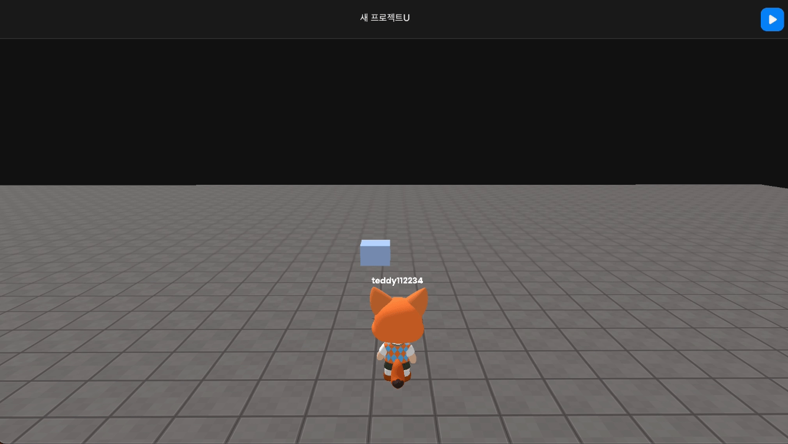

import { Callout } from "nextra/components";
import { Steps } from "nextra/components";
import { Tabs } from "nextra/components";

# 반복적으로 움직이는 객체 만들기

<Steps>
### 객체를 배치하세요.
  
  객체를 밟아야 하는 위치에 배치하고 이름을 변경하세요. 
  
### Code

```js showLineNumbers
const movebox = WORLD.getObject("BOX(f7b)");
const patrol = new TWEEN.Tween(movebox.position)
  .to({ x: "-10" }, 2000)
  .repeat(Infinity)
  .yoyo(true)
  .start();
```

<Callout type="error">
  Physics에서 Body를 활성화한 후에 정지된 것처럼 보인다면 걱정하지 마세요. 아래와 같이 onUpdate를 추가하면 됩니다.

    ```js showLineNumbers {5}
    const movebox = WORLD.getObject("BOX(f7b)");
    const patrol = new TWEEN.Tween(movebox.position)
        .to({ x: "-10" }, 2000)
        .repeat(Infinity)
        .onUpdate(()=>{movebox.body.needUpdate = true;})
        .yoyo(true)
        .start();
    ```

</Callout>
<br />
<center> Result </center>

</Steps>
