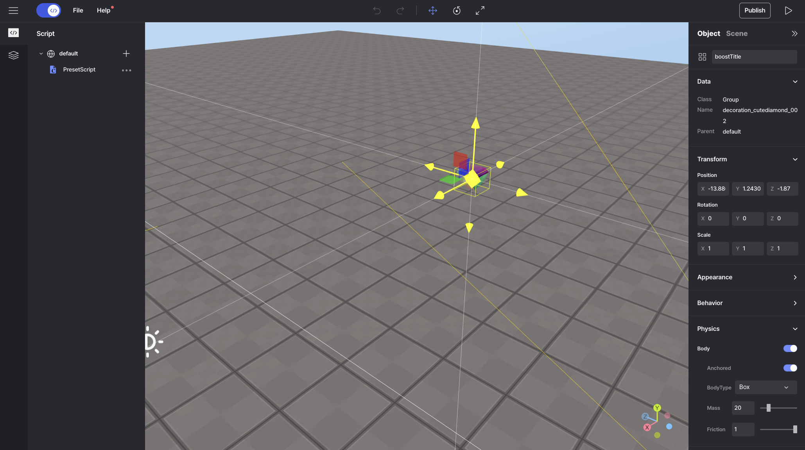

import { Callout } from "nextra/components";
import { Steps } from "nextra/components";
import { Tabs } from "nextra/components";

# 아바타 속도 변경하기

<Callout type="info">
  아바타의 움직임 속도를 변경하려면 기본적으로 `avatar.changePlayerSpeed(1)`를
  사용할 수 있습니다. 기본 속도는 1입니다. 아바타 API에 대한 더 많은 정보는
  [여기](../script/api/avatar)에서 확인할 수 있습니다.
</Callout>
<Callout type="error" icon="‼️">
  `onCollide` 같은 메소드를 사용하려면 객체의 속성 패널에서 Body를 체크하는 것을
  잊지 마세요!
  <center> 물리학 -> 몸체</center>
</Callout>

<br />
<center> Result </center>

<Steps>

### 원하는 곳에 객체를 배치하세요.

원하는 위치에 객체를 놓으세요.

<br />
<center> Boost Item </center>

### Code

```js showLineNumbers copy
const boost = WORLD.getObject("boostTitle");

function Start() {
  // use here PLAYER related logic
  boost.onCollide(PLAYER, () => {
    boost.kill();
    //change PLAYER speed
    PLAYER.changePlayerSpeed(2);
  });
}
```

### 특정 아이템을 먹을 때 3초 동안 빠르게 만들어주세요.

```js showLineNumbers copy
const boost = WORLD.getObject("boostTitle");

function Start() {
  // use here PLAYER related logic
  boost.onCollide(PLAYER, () => {
    boost.kill();
    //change PLAYER speed
    PLAYER.changePlayerSpeed(2);
    setTimeout(() => {
      PLAYER.changePlayerSpeed(1);
    }, 3000); //wait 3 seconds
  });
}
```

</Steps>
