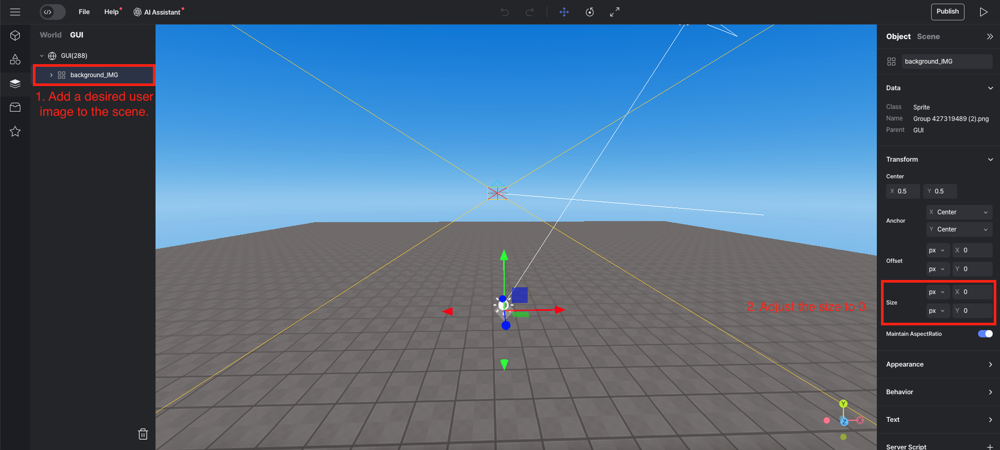

import { Callout, Code } from "nextra/components";
import { Steps } from "nextra/components";
import { Tabs } from "nextra/components";

# 게임 플레이 중 배경이미지 바꾸기


## Steps

<Steps>

### 씬에 이미지 추가 및 크기 설정

1. 씬에 이미지를 추가하는 방법은 [이곳](../engine/operate/left/my-asset.mdx)을 참고해 주세요.  
2. 추가한 이미지의 크기를 0으로 조절합니다.  
<br/>
<center></center>

### 스크립트 작성 

이 스니펫에서는 특정 오브젝트에 닿으면 배경이미지가 바뀌도록 로직을 만들겠습니다.  
이를 위해 씬에 충돌검사를 위한 오브젝트를 배치하고, 배경 이미지를 변경 할 코드를 작성합니다.  

<Callout type="warning">
  `onCollide`를 사용하려면 오브젝트의 속성 패널에서 Body를 체크해야 합니다.
  <center> Physics -> Body</center>
</Callout>

```js showLineNumbers copy filename="Set_background"
const obj = WORLD.getObject("obj");

obj.onCollide(PLAYER, function() {
    const newBackground = GUI.getObject("background_IMG").material.map; //배경 이미지 map 불러오기
    newBackground.wrapS = THREE.RepeatWrapping;
    newBackground.wrapT = THREE.RepeatWrapping;
    newBackground.mapping = THREE.EquirectangularReflectionMapping;
    newBackground.encoding = THREE.sRGBEncoding;
    newBackground.repeat.set(1, 1);
    WORLD.background = newBackground; // 새로운 배경 설정
})
```


### 게임 내에서 오브젝트와 접촉하기

게임을 실행한 뒤 오브젝트와 접촉하면 배경이미지가 바뀝니다.  

</Steps>