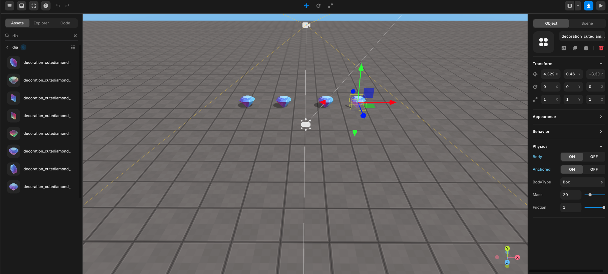

import { Callout } from "nextra/components";
import { Steps } from "nextra/components";
import { Tabs } from "nextra/components";

# 아이템 수집하기

<Steps>

### 원하는 곳에 객체를 배치하세요.

    <Callout type="info">
        많은 아이템이 있는 경우 정리하기가 어려울 수 있으므로 제목을 더 읽기 쉽게 만드는 것이 좋은 아이디어입니다.
    </Callout>

    <Callout type="error" icon="‼️">
    `onCollide` 같은 메소드를 사용하려면 객체의 속성 패널에서 Body를 체크하는 것을
    잊지 마세요!
    <center> 물리학 -> 몸체</center>
    </Callout>

    <br/>
    <center> Place items </center>

### Code

<Callout type="info">
  `아바타 사용 방법`에 대한 더 많은 정보는 [여기](./use-avatar)에서 확인할 수
  있습니다.
</Callout>

<Tabs items={["example 1", "example 2"]} defaultIndex="0">
    <Tabs.Tab>
        <Callout type="info">
            다음은 그것을 하는 기본적인 예제입니다. 더 개선된 해결책을 원하시면 예제 2를 참조하세요 👉🏼.
        </Callout>
        ```js showLineNumbers filename="PresetScript" {1-5, 14-28}
        const diamond0 = WORLD.getObject("diamond0");
        const diamond1 = WORLD.getObject("diamond1");
        const diamond2 = WORLD.getObject("diamond2");
        const diamond3 = WORLD.getObject("diamond3");
        const diamond4 = WORLD.getObject("diamond4");

        function Start() {
            (async () => {
                const avatar = await REDBRICK.AvatarManager.createDefaultAvatar();
                const camera = WORLD.getObject("MainCamera");
                const followingCamera = avatar.setFollowingCamera(camera);
                avatar.setDefaultController();

                diamond0.onCollide(avatar, () => {
                    diamond0.kill();
                });
                diamond1.onCollide(avatar, () => {
                    diamond1.kill();
                });
                diamond2.onCollide(avatar, () => {
                    diamond2.kill();
                });
                diamond3.onCollide(avatar, () => {
                    diamond3.kill();
                });
                diamond4.onCollide(avatar, () => {
                    diamond4.kill();
                });

            })();
        }
        ```
    </Tabs.Tab>
    <Tabs.Tab>

        여기에는 중복된 줄을 최소화한 사용 예제가 조금 더 개선된 버전이 있습니다.

        ```js showLineNumbers filename="PresetScript" {9, 17, 19-21}
        function Start() {
            (async () => {
                const avatar = await REDBRICK.AvatarManager.createDefaultAvatar();
                const camera = WORLD.getObject("MainCamera");
                const followingCamera = avatar.setFollowingCamera(camera);
                avatar.setDefaultController();

                //call function
                collisionSetUp(avatar);

            })();
        }

        function collisionSetUp(avatar) {
            // 5 diamonds
            for (let i = 0; i < 5; i++) {
                const diamond = WORLD.getObject("diamond" + i);

                diamond.onCollide(avatar, () => {
                    diamond.kill();
                });
            }
        }
        ```
    </Tabs.Tab>

</Tabs>

</Steps>
