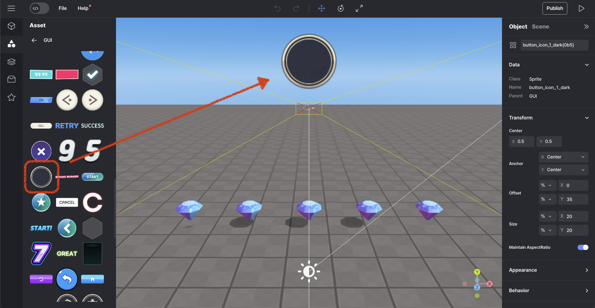

import { Callout } from "nextra/components";
import { Steps } from "nextra/components";
import { Tabs } from "nextra/components";

# 아이템을 획득할 때 화면에 카운트되게 만들기

<Steps>
### 원하는 GUI를 선택하고 장면에 넣으세요.

<br />
<center> Place GUI </center>

### Code

<Tabs items={["example 1", "example 2"]} defaultIndex="0">
    <Tabs.Tab>
        
        _다음은 그것을 하는 기본적인 예제입니다. 개선된 해결책을 원하시면 예제 2를 참고하세요 👉🏼._

         ```js showLineNumbers {8-10, 15-16, 20-21, 25-26, 30-31, 35-36}
        const diamond0 = WORLD.getObject("diamond0");
        const diamond1 = WORLD.getObject("diamond1");
        const diamond2 = WORLD.getObject("diamond2");
        const diamond3 = WORLD.getObject("diamond3");
        const diamond4 = WORLD.getObject("diamond4");

        //intialize gui
        const showpoint = GUI.getObject("guiBoardTitle");
        let diamondCount = 0;
        showpoint.setText(diamondCount);

        function Start() {
            diamond0.onCollide(PLAYER, () => {
                diamond0.kill();
                diamondCount += 1;
                showpoint.setText(diamondCount);
            });
            diamond1.onCollide(PLAYER, () => {
                diamond1.kill();
                diamondCount += 1;
                showpoint.setText(diamondCount);
            });
            diamond2.onCollide(PLAYER, () => {
                diamond2.kill();
                diamondCount += 1;
                showpoint.setText(diamondCount);
            });
            diamond3.onCollide(PLAYER, () => {
                diamond3.kill();
                diamondCount += 1;
                showpoint.setText(diamondCount);
            });
            diamond4.onCollide(PLAYER, () => {
                diamond4.kill();
                diamondCount += 1;
                showpoint.setText(diamondCount);
            });
        }
        ```
    </Tabs.Tab>
    <Tabs.Tab>

        _여기에는 중복된 줄을 최소화한 사용 예제가 조금 개선된 버전이 있습니다._

         ```js showLineNumbers  {2-4, 12-13}
        //intialize gui
        const showpoint = GUI.getObject("guiBoardTitle");
        let diamondCount = 0;
        showpoint.setText(diamondCount);

        function Start() {
        // since we have 5 diamonds
            for (let i = 0; i < 5; i++) {
                const diamond = WORLD.getObject("diamond" + i);
                diamond.onCollide(PLAYER, () => {
                    diamond.kill();
                    diamondCount += 1;
                    showpoint.setText(diamondCount);
                });
            }
        }
        ```
    </Tabs.Tab>

</Tabs>

<br />
<center> GUI display </center>
</Steps>
