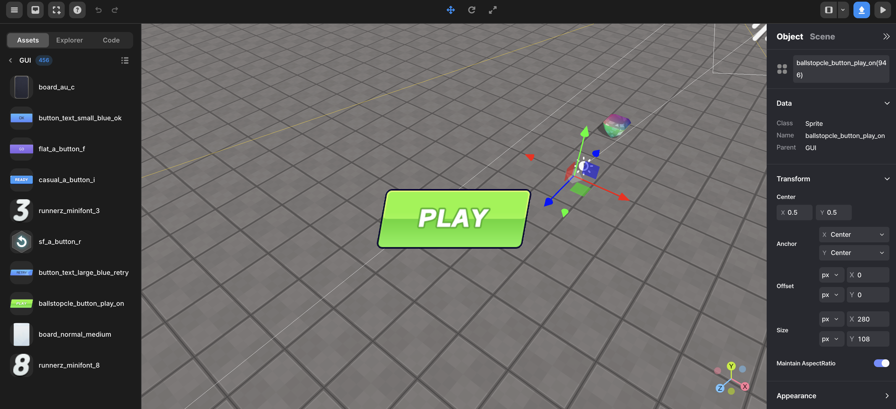

import { Callout } from "nextra/components";
import { Steps } from "nextra/components";
import { Tabs } from "nextra/components";

# 게임 시작 버튼 만들기

<Steps>

### 원하는 시작 버튼 선택

왼쪽 상단의 + 버튼을 클릭 -> GUI -> 원하는 시작 버튼 선택

<br />
<center>
   시작 버튼 선택하기{" "}
</center>

### Code

```js showLineNumbers copy filename="otherScript"
const startbtn = GUI.getObject("ballstopcle_button_play_on(e77)");

function Start() {
  startbtn.onClick(() => {
    startbtn.hide();
  });
}
```

위의 스크립트가 시작 버튼 스크립트의 일부인 경우 다음과 같이 작성할 수 있습니다:

```js showLineNumbers copy filename="ballstopcle_button_play_on(e77)"
function Start() {
  this.onClick(() => {
    this.hide();
  });
}
```

</Steps>
