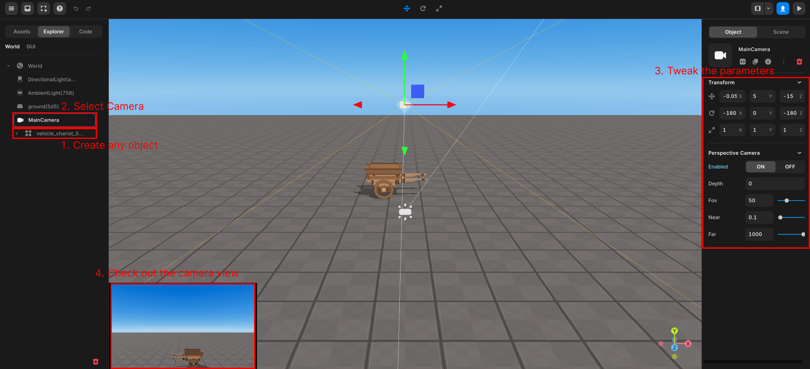

import { Callout, Code } from "nextra/components";
import { Steps } from "nextra/components";
import { Tabs } from "nextra/components";

# 쿼터뷰 카메라 만들기


### Steps

<Steps>

### 카메라의 위치, 각도, 거리 등을 설정합니다.

1. 씬에 아무 오브젝트나 추가합니다.  
2. 좌측 오브젝트 패널에서 카메라를 선택합니다.  
3. 우측 속성 패널에서 카메라의 세부적인 파라미터(위치, 각도, 거리 등)를 설정합니다.  
4. 카메라 뷰를 통해 실제 게임에서 어떻게 보일지 확인합니다.  
5. 값을 계속 변경해가며 마음에 드는 값을 찾습니다.  

<center></center>

### 카메라 설정을 위한 스크립트 추가

씬 스크립트를 생성하여 아래와 같은 코드를 입력합니다.  

```js showLineNumbers copy filename="Camera_Setting"
//카메라가 플레이어 위치로부터 떨어진 거리, 로테이션 값
const CAMERA_POSITION_WEIGHT_Z = 20;
const CAMERA_POSITION_WEIGHT_Y = 20; 
const CAMERA_ROTATION_X = -40;

const avatar = REDBRICK.AvatarManager.createDefaultAvatar();
const camera = WORLD.getObject("MainCamera");
avatar.setDefaultController();

//카메라 Y값 및 로테이션 초기값 설정
camera.position.y = CAMERA_POSITION_WEIGHT_Y;
camera.rotation.set(toRadians(CAMERA_ROTATION_X), 0, 0); //rotation.set() 메소드는 매개변수를 라디안으로 입력 받습니다

// Degree (도)를 Radian (라디안)으로 변환하는 함수
function toRadians(degrees) {
  return degrees * Math.PI / 180;
}

//매 프레임 마다 카메라의 X와 Z값을 플레이어로부터 일정한 거리로 업데이트 해줍니다
function Update(){
    camera.position.x = avatar.position.x;
    camera.position.z = avatar.position.z + CAMERA_POSITION_WEIGHT_Z;
}
```
카메라의 Y값과 로테이션은 고정되어있고, X와 Z값은 지속적으로 업데이트 해주어야 합니다.  
따라서 Y와 로테이션 값은 초기에 한번만 설정해주고, 업데이트 함수내에서 X와 Z값을 지속적으로 업데이트 해줍니다. 
</Steps>