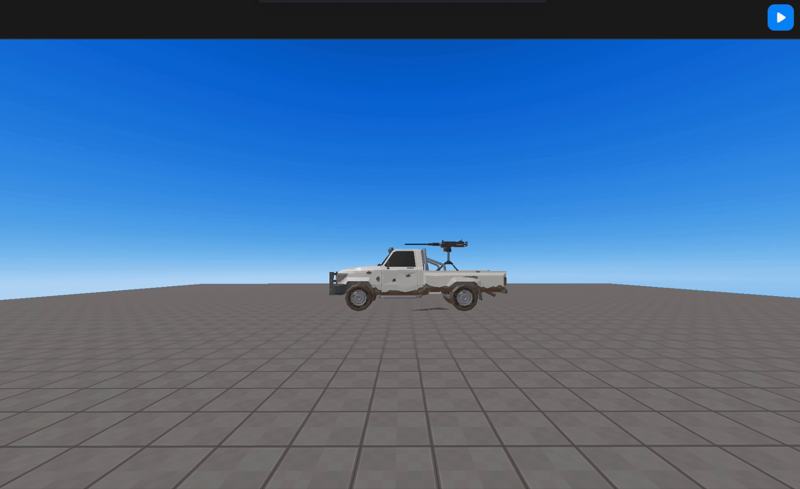

import { Callout } from "nextra/components";
import { Steps } from "nextra/components";
import { Tabs } from "nextra/components";

# 슈팅 게임 만들기

<Steps>

### 먼저 슈팅 로직 코드를 작성하세요

`camera.useFPS()`로 FPS 모드를 설정하고, `OnPointerDown()`을 사용하여 마우스 클릭을 감지해 `createBullet()`을 트리거합니다.  
이 함수는 총알을 초기화하고 배치하며, `BULLET_SPEED`와 `BULLET_RANGE_SQUARED`를 사용하여 총알의 속도와 범위를 정의합니다.  
그런 다음, 총알을 씬에 추가하고 `Update()`를 통해 `moveBullets()`를 호출하여 총알의 이동과 범위를 벗어난 총알의 제거를 처리합니다.

<br />
<center> 슈팅</center>

```js showLineNumbers copy filename="Shooting logic"
const camera = WORLD.getObject("MainCamera");
camera.useFPS();

let bullets = [];
const BULLET_SPEED = 1.5;
const BULLET_RANGE_SQUARED = 30000;

// 포인터를 눌렀을 때 트리거됩니다.
function OnPointerDown() {
  createBullet();
}

// 총알을 생성하고 초기 속성을 설정합니다.
function createBullet() {
  let cameraDirection = new THREE.Vector3();
  camera.getWorldDirection(cameraDirection);
  cameraDirection.setLength(BULLET_SPEED);

  const cameraPosition = camera.position;

  const geometry = new THREE.SphereGeometry(1, 32, 32);
  const material = new THREE.MeshBasicMaterial({ color: 0x00ff00 });
  const bullet = new THREE.Mesh(geometry, material);

  // 카메라 앞에 총알을 배치합니다.
  bullet.position.set(
    cameraPosition.x + cameraDirection.x,
    cameraPosition.y + cameraDirection.y,
    cameraPosition.z + cameraDirection.z
  );
  bullet.rotation.copy(camera.rotation);

  bullets.push({ object: bullet, direction: cameraDirection.clone() });

  WORLD.add(bullet);
}

// 일반적으로 프레임마다 상태를 업데이트합니다.
function Update(dt) {
  moveBullets();
}

// 총알을 이동시키고 수명주기를 관리합니다.
function moveBullets() {
  for (let i = bullets.length - 1; i >= 0; i--) {
    const bullet = bullets[i];
    const bulletPosition = bullet.object.position;
    const movementVector = bullet.direction;

    bullet.object.position.set(
      bulletPosition.x + movementVector.x,
      bulletPosition.y + movementVector.y,
      bulletPosition.z + movementVector.z
    );

    // 총알이 정의된 범위를 벗어났는지 확인합니다.
    if (
      bullet.object.position.distanceToSquared(PLAYER.position) >
      BULLET_RANGE_SQUARED
    ) {
      WORLD.remove(bullet.object);
      bullet.object.geometry.dispose();
      bullet.object.material.dispose();
      bullets.splice(i, 1);
    }
  }
}
```

### 타겟 객체 추가하기

`TARGET_HIT_RANGE`로 피격 감지 범위를 정의하고 타겟을 저장할 배열 `targetObjects`를 초기화합니다.  
`"car"`와 같은 객체를 `WORLD.getObject()`를 사용하여 `targetObjects에` 추가합니다.  
`moveBullets()`를 수정하여 targetObjects와의 충돌 감지를 추가하고, 각 총알과 타겟 사이의 거리를 확인합니다.  
총알이 `TARGET_HIT_RANGE` 내에 있는 경우, `target.kill()`을 호출하여 히트를 처리하고 총알을 씬에서 제거하고, 관련 리소스를 정리합니다.

<br />
<center> 슈팅 타겟</center>

```js showLineNumbers copy filename="Shooting logic" {1, 3-4, 14-26}
const TARGET_HIT_RANGE = 32;

const targetObjects = [];
targetObjects.push(WORLD.getObject("car"));
// 필요에 따라 더 많은 객체를 targetObjects에 추가하세요.

// 다른 코드

// moveEnergyBall 내부에서
function moveEnergyBall() {
  // 다른 코드

  // 총알이 타겟을 맞추는지 확인
  for (let j = 0; j < targetObjects.length; j++) {
    const target = targetObjects[j];
    if (
      bullet.object.position.distanceToSquared(target.position) <
      TARGET_HIT_RANGE
    ) {
      target.kill(); // 타겟 피격 처리
      WORLD.remove(bullet.object);
      bullet.object.geometry.dispose();
      bullet.object.material.dispose();
      bullets.splice(i, 1);
    }
  }
}
```

### 최종 코드

이 코드를 복사하여 붙여넣고 슈팅 기능을 사용하세요. 타겟 객체를 변경하는 것을 잊지 마세요.

```js showLineNumbers copy filename="Shooting logic" {10}
const camera = WORLD.getObject("MainCamera");
camera.useFPS();

let bullets = [];
const BULLET_SPEED = 1.5;
const BULLET_RANGE_SQUARED = 30000;
const TARGET_HIT_RANGE = 32;

const targetObjects = [];
targetObjects.push(WORLD.getObject("car")); // 타겟을 변경하세요
// 필요에 따라 더 많은 객체를 targetObjects에 추가하세요.

// 포인터를 눌렀을 때 트리거됩니다.
function OnPointerDown() {
  createBullet();
}

// 총알을 생성하고 초기 속성을 설정합니다.
function createBullet() {
  let cameraDirection = new THREE.Vector3();
  camera.getWorldDirection(cameraDirection);
  cameraDirection.setLength(BULLET_SPEED);

  const cameraPosition = camera.position;

  const geometry = new THREE.SphereGeometry(1, 32, 32);
  const material = new THREE.MeshBasicMaterial({ color: 0x00ff00 });
  const bullet = new THREE.Mesh(geometry, material);

  // 카메라 앞에 총알을 배치합니다.
  bullet.position.set(
    cameraPosition.x + cameraDirection.x,
    cameraPosition.y + cameraDirection.y,
    cameraPosition.z + cameraDirection.z
  );
  bullet.rotation.copy(camera.rotation);

  bullets.push({ object: bullet, direction: cameraDirection.clone() });

  WORLD.add(bullet);
}

// 일반적으로 프레임마다 상태를 업데이트합니다.
function Update(dt) {
  moveBullets();
}

// 총알을 이동시키고 수명주기를 관리합니다.
function moveBullets() {
  for (let i = bullets.length - 1; i >= 0; i--) {
    const bullet = bullets[i];
    const bulletPosition = bullet.object.position;
    const movementVector = bullet.direction;

    bullet.object.position.set(
      bulletPosition.x + movementVector.x,
      bulletPosition.y + movementVector.y,
      bulletPosition.z + movementVector.z
    );

    // 총알이 정의된 범위를 벗어났는지 확인합니다.
    if (
      bullet.object.position.distanceToSquared(PLAYER.position) >
      BULLET_RANGE_SQUARED
    ) {
      WORLD.remove(bullet.object);
      bullet.object.geometry.dispose();
      bullet.object.material.dispose();
      bullets.splice(i, 1);
    }

    for (let j = 0; j < targetObjects.length; j++) {
      const target = targetObjects[j];
      if (
        bullet.object.position.distanceToSquared(target.position) <
        TARGET_HIT_RANGE
      ) {
        target.kill(); // 타겟 피격 처리
        WORLD.remove(bullet.object);
        bullet.object.geometry.dispose();
        bullet.object.material.dispose();
        bullets.splice(i, 1);
      }
    }
  }
}
```

### 커스터마이즈 하기

총과 GUI를 추가하여 커스터마이즈 할 수 있습니다.

<br />
<center> 커스텀 슈팅 게임</center>

</Steps>
