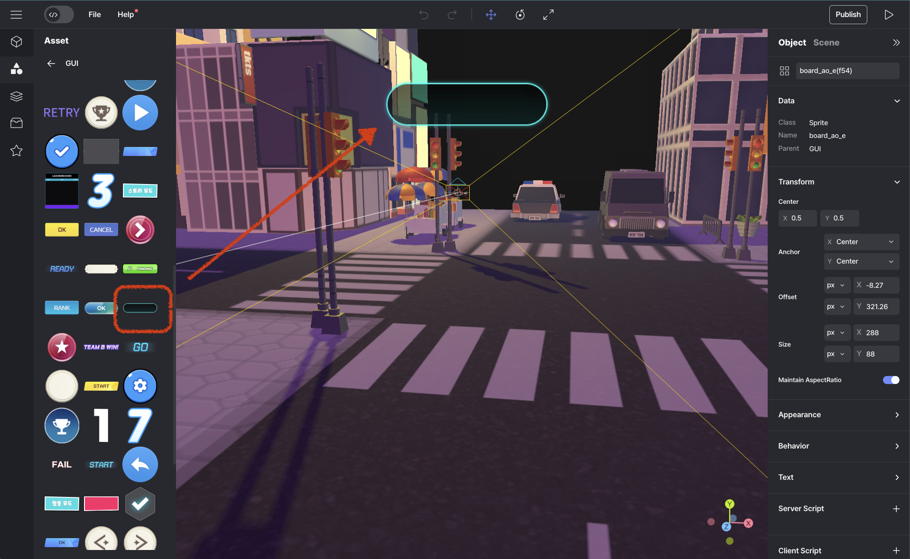
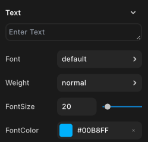

import { Callout } from "nextra/components";
import { Steps } from "nextra/components";
import { Tabs } from "nextra/components";

# 타이머, 카운트다운 만들기

<Steps>

### GUI를 선택하세요.

카운트다운 및 타이머를 표시할 GUI를 선택합니다.

<br />
<center>
   타이머, 카운트다운 GUI 선택하기
</center>

<Callout type="info">
  여기에서 GUI 속성을 조절할 수 있습니다.
  <br />
  <center> GUI 속성</center>
</Callout>

### Code

<Tabs items={["example 1", "example 2"]} defaultIndex="0" >

  <Tabs.Tab>
    
setInterval()을 사용하여 타이머를 시작할 수 있습니다.

    ```js showLineNumbers copy filename="timer"
    let count = 0;
    const countboard = GUI.getObject("startBD");

    function Start() {
      const startCount = setInterval(() => {
        count++;
        countboard.setText(count, true);
      }, 1000);
    }
    ```

    clearInterval()를 사용하여 타이머를 중지할 수 있습니다.

    ```js showLineNumbers copy filename="timer" {8-10}
    let count = 0;
    const countboard = GUI.getObject("startBD");

    function Start() {
      const startCount = setInterval(() => {
        count++;
        countboard.setText(count, true);
        if (count >= 10) {
          clearInterval(startCount);
        }
      }, 1000);
    }
    ```

  </Tabs.Tab>
  <Tabs.Tab>
    아것은 REDBRICK 타이머를 사용하여 비슷한 결과를 낸 것입니다.

    ```js showLineNumbers copy filename="timer"
    let count = 0;
    const countboard = GUI.getObject("startBD")

    const timer = new REDBRICK.Timer();

    function Start() {
        countboard.setText(count, true);
        timer.start();
    }

    function Update(dt){
        count = Math.floor( timer.getTime() );
        countboard.setText( count ,true);
    }
    ```

    <Callout type='info'>
      "REDBRICK.Timer"에 대한 정보는 [여기](../script/built-in/redbrick/timer)에서 찾을 수 있습니다.
    </Callout>

    ```js showLineNumbers copy filename="timer" {8-10}
    let count = 0;
    const countboard = GUI.getObject("startBD")

    const timer = new REDBRICK.Timer();

    function Start() {
        countboard.setText(count, true);
        timer.start();
    }

    function Update(dt){
        count = Math.floor( timer.getTime() );
        if (count >= 10){
          timer.pause();
        }
        countboard.setText( count ,true);
    }
    ```

  </Tabs.Tab>
</Tabs>
<br />
<center>
   Result
</center>
</Steps>
