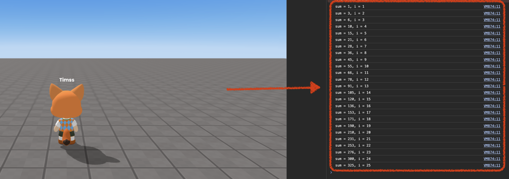

import { Callout } from "nextra/components";
import { Steps } from "nextra/components";
import { Tabs } from "nextra/components";

# 디버깅 및 오류 해결 방법은?

에러를 찾는 여러 가지 방법이 있습니다.

<Steps>

### 콘솔

무언가 작동하지 않는다면, 콘솔에 무언가를 기록하기 위해 console.log()를 사용하여 시작할 수 있습니다. 콘솔을 열려면 F12를 눌러 볼 수 있습니다.

<Tabs items={["example 1", "example 2"]} defaultIndex="0">

    <Tabs.Tab>
        ```js showLineNumbers copy {6}
        let sum = 0;

        //sum until 25
        for (let i = 1; i <= 25; i++) {
            sum += i;
            console.log(`sum = ${sum}, i = ${i}`);
        }

        ```

        <br />
        <center> Console result </center>

    </Tabs.Tab>

    <Tabs.Tab>

    객체와 그들의 속성도 확인할 수 있습니다. 이를 더 자세히 설명하기 위한 예제가 있습니다.

     ```js showLineNumbers copy {6}
        const item = WORLD.getOjbect("item");

        console.log(item);

        ```

        <br />
        <center> Console result </center>
    </Tabs.Tab>

</Tabs>

### 프로젝트 저장 및 다시 열기

모든 것이 정상이라고 생각되고 오류를 찾을 수 없다면, "파일로 저장" 옵션을 사용하여 파일을 저장하려고 시도하십시오.

그 후 새 프로젝트를 생성하고 "파일에서 열기"를 사용하여 엽니다.

마지막으로 프로젝트를 다시 재생하여 문제가 해결되었는지 확인하십시오.

<Callout type="error">
  여전히 작동하지 않는 경우, [Discord 채널](https://discord.com/invite/redbrick-create)을 통해 연락해보세요.
</Callout>
</Steps>
