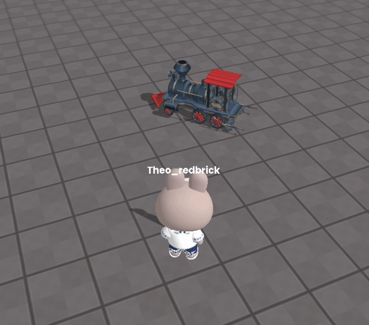

import { Callout, Code } from "nextra/components";
import { Steps } from "nextra/components";
import { Tabs } from "nextra/components";

# 오브젝트 지속적으로 회전 시키기

<center>
<br/>

<br/>
</center>

다음과 같은 방법들로 간단하게 구현할 수 있습니다.  

<Tabs items={["example 1", "example 2"]} defaultIndex="0" >
  <Tabs.Tab>
    이것은 rotation 값을 직접 수정하는 방법입니다.

    ```js copy showLineNumbers filename="rotation"
    const SPEED = 5;

    const obj = WORLD.getObject('obj');

    function Update(dt){
        obj.rotation.y += dt * SPEED;
        
        //오브젝트의 Physics Body 속성이 활성화 되어있다면, 아래 코드를 실행해야합니다.
        // obj.body.needUpdate = true;
    }
    ```

  </Tabs.Tab>
  <Tabs.Tab>
    이것은 rotate 함수를 이용한 방법입니다.
    ```js copy showLineNumbers filename="rotation"
    const SPEED = 5;

    const obj = WORLD.getObject('obj');

    function Update(dt){
        obj.rotate(0, SPEED, 0);
        
        //오브젝트의 Physics Body 속성이 활성화 되어있다면, 아래 코드를 실행해야합니다.
        // obj.body.needUpdate = true;
    }
    ```
  </Tabs.Tab>
</Tabs>