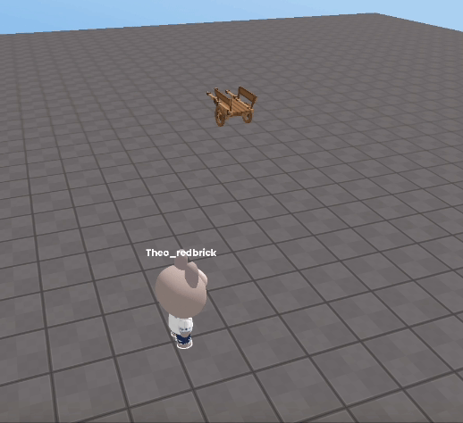

import { Callout, Code } from "nextra/components";
import { Steps } from "nextra/components";
import { Tabs } from "nextra/components";

# 랜덤한 위치 설정하기

<br />
<center> Example</center>

특정 범위내에서 랜덤한 위치를 설정하는 방법을 알아보겠습니다.  
이 예제에서는 0.5초마다 랜덤한 위치로 오브젝트를 이동시키게 했습니다.  

```js showLineNumbers copy filename="random_position"
//특정 범위 내에서 랜덤한 값을 뽑아내기 위해 범위를 지정합니다  MIN:최솟값, MAX:최댓값
const X_RANGE = {"MIN" : 10, "MAX" : 20};
const Y_RANGE = {"MIN" : 1, "MAX" : 5};
const Z_RANGE = {"MIN" : 10, "MAX" : 20};

const obj = WORLD.getObject("obj");

//0.5초마다 범위내에 랜덤한 위치로 오브젝트를 이동시킵니다.
setInterval(function() {
  const random_x = Math.floor(Math.random() * (X_RANGE.MAX - X_RANGE.MIN + 1)) + X_RANGE.MIN;
  const random_y = Math.floor(Math.random() * (Y_RANGE.MAX - Y_RANGE.MIN + 1)) + Y_RANGE.MIN;
  const random_z = Math.floor(Math.random() * (Z_RANGE.MAX - Z_RANGE.MIN + 1)) + Z_RANGE.MIN;
  
  obj.position.set(random_x, random_y, random_z);
}, 500);
```
