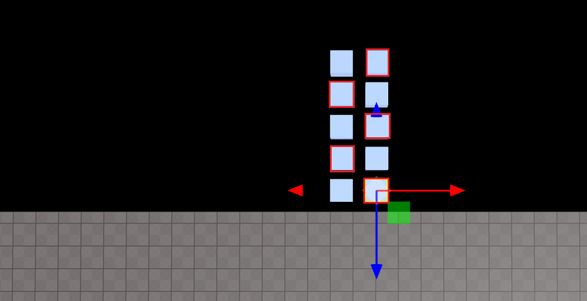
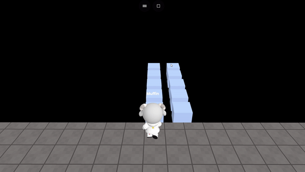

import { Callout } from "nextra/components";
import { Steps } from "nextra/components";
import { Tabs } from "nextra/components";

# 밟으면 사라지는 디딤돌 만들기

<Steps>

### 원하는 곳에 객체 배치하기

디딤돌을 만들고 사라져야 할 돌의 이름을 변경하세요.

<br />
<center> 디딤돌 놓기</center>

<Callout type="error" icon="‼️">
  `onCollide` 같은 메소드를 사용하려면 객체의 속성 패널에서 Body를 체크하는 것을
  잊지 마세요!
  <center> 물리학 -> 몸체</center>
</Callout>

### Code

```js showLineNumbers copy
const falseboxes = [];
for (let i = 0; i < 5; i++) {
  falseboxes[i] = WORLD.getObject("falsebox_" + i);
}

function Start() {
  falseboxes.forEach((box) => {
    box.onCollide(PLAYER, () => {
      box.kill();
      setTimeout(() => {
        box.revive();
      }, 1000);
    });
  });
}
```

<br />
<center> Result</center>
</Steps>
