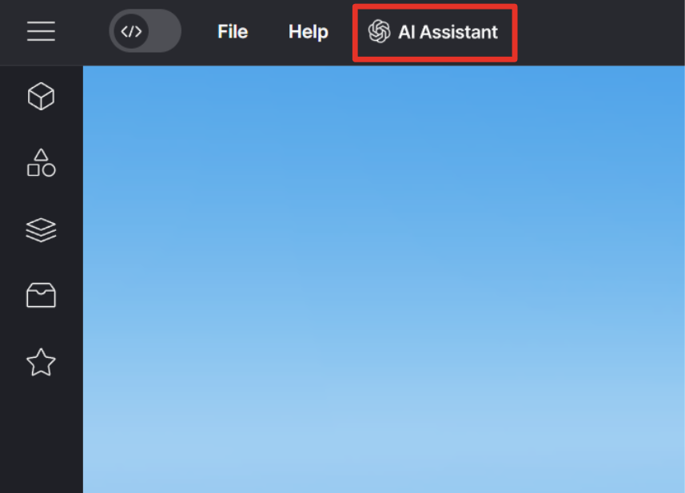
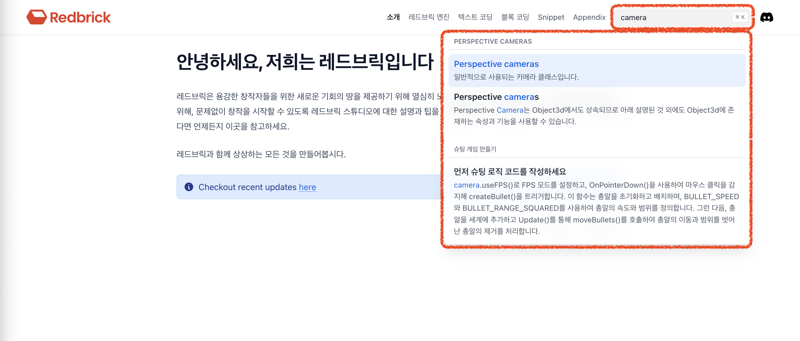

import { Callout } from "nextra/components";
import { Steps } from "nextra/components";
import { Cards } from "nextra/components";

import { YouTube } from "mdx-embed";

# SSAFY 12기 디스코드 질문 매뉴얼

안녕하세요 레드브릭 디스코드 대응팀입니다. 12기 학생 여러분, 아래 내용을 충분히 읽어보시면 원활한 프로젝트 수행에 도움이 될 것입니다.

## ✅ 체크사항

- 원활한 질의응답을 위해 **팀에서 1명만** 디스코드 채널에 입장해 주시면 감사하겠습니다.
- 플랫폼 가입 및 로그인 **Click** > [CREATE REDBRICK LAND](https://create.redbrick.land/)
- 디스코드 가입 및 로그인, 채널 입장

## 📌 질문하기 전에 확인해주세요!

<Steps>

### 🤖 코드가 작동하지 않을 때는 AI Assistant를 적극 활용해주세요

<Callout type="info">

- 유튜브 영상 보러 가기 Click > [Redbrick's AI Assistant 🤖🚀🔥](https://www.youtube.com/watch?v=j6z4vIZskpg)

 Redbrick's AI Assistant

- 잘 질문하는 꿀Tip! Click > [AI Assistant (GPT)을 올바르게 사용하는 방법](../faq/ai-assistant)

</Callout>
 
<YouTube youTubeId="j6z4vIZskpg" />

### 📖 레드브릭 스튜디오 Wiki는 확인했나요?

<Callout type="info">

- Wiki 보러 가기 Click > [Redbick Wiki](../)

- 검색창에 키워드로 검색해주세요.

 Wiki search

</Callout>

### 👋 내가 하는 고민은 다른 사람도 했다! 자주 하는 질문에 있는지 찾아보세요!

<Cards>
  <Cards.Card
    icon={
      <svg
        xmlns="http://www.w3.org/2000/svg"
        fill="none"
        viewBox="0 0 24 24"
        stroke-width="1.5"
        stroke="currentColor"
      >
        <path
          stroke-linecap="round"
          stroke-linejoin="round"
          d="M12 9v3.75m-9.303 3.376c-.866 1.5.217 3.374 1.948 3.374h14.71c1.73 0 2.813-1.874 1.948-3.374L13.949 3.378c-.866-1.5-3.032-1.5-3.898 0L2.697 16.126zM12 15.75h.007v.008H12v-.008z"
        />
      </svg>
    }
    title="자주하는 질문 FAQ"
    href="../faq/questions"
  />
</Cards>

### 💃 예제 게임에 있는 스니펫을 그대로 쓰고 싶다면?

<Callout type="info">
  🫶🏻 스니펫을 모은 스니펫 월드 파일을 공유드립니다.
</Callout>

<Cards>
  <Cards.Card
    icon={
      <svg
        xmlns="http://www.w3.org/2000/svg"
        fill="none"
        viewBox="0 0 24 24"
        stroke-width="1.5"
        stroke="currentColor"
      >
        <path
          stroke-linecap="round"
          stroke-linejoin="round"
          d="M19.5 14.25v-2.625a3.375 3.375 0 00-3.375-3.375h-1.5A1.125 1.125 0 0113.5 7.125v-1.5a3.375 3.375 0 00-3.375-3.375H8.25m0 12.75h7.5m-7.5 3H12M10.5 2.25H5.625c-.621 0-1.125.504-1.125 1.125v17.25c0 .621.504 1.125 1.125 1.125h12.75c.621 0 1.125-.504 1.125-1.125V11.25a9 9 0 00-9-9z"
        />
      </svg>
    }
    title="스니펫 월드 사용방법 🙋🏻"
    href="./snippet_world"
  />
</Cards>

### 🙅‍♂️ 레드브릭 스튜디오는 이 기능은 지원하지 않아요!

<Cards>
  <Cards.Card
    icon={
      <svg
        xmlns="http://www.w3.org/2000/svg"
        fill="none"
        viewBox="0 0 24 24"
        stroke-width="1.5"
        stroke="currentColor"
      >
        <path
          stroke-linecap="round"
          stroke-linejoin="round"
          d="M4.5 12a7.5 7.5 0 0015 0m-15 0a7.5 7.5 0 1115 0m-15 0H3m16.5 0H21m-1.5 0H12m-8.457 3.077l1.41-.513m14.095-5.13l1.41-.513M5.106 17.785l1.15-.964m11.49-9.642l1.149-.964M7.501 19.795l.75-1.3m7.5-12.99l.75-1.3m-6.063 16.658l.26-1.477m2.605-14.772l.26-1.477m0 17.726l-.26-1.477M10.698 4.614l-.26-1.477M16.5 19.794l-.75-1.299M7.5 4.205L12 12m6.894 5.785l-1.149-.964M6.256 7.178l-1.15-.964m15.352 8.864l-1.41-.513M4.954 9.435l-1.41-.514M12.002 12l-3.75 6.495"
        />
      </svg>
    }
    title="지원되지 않는 기능들"
    href="../faq/not-supported-features"
  />
</Cards>

</Steps>

## 📌 질문할 때 주의해주세요!

### 🛠️ 코드 작동이 안될 때

1. 코드를 다시 한번 확인해주세요
2. 질문 시 아래 내용을 모두 포함하여 질문해 주세요
   - 어떤 것을 구현하고 싶은지
   - 어떻게 안되는지
   - 에셋 이름, 안되는 코드를 복사하여 공유
   - 화면 캡쳐 첨부 (코드는 캡쳐보다 복사 해주시는게 해결에 용이합니다.)

좋은 질문 예시

