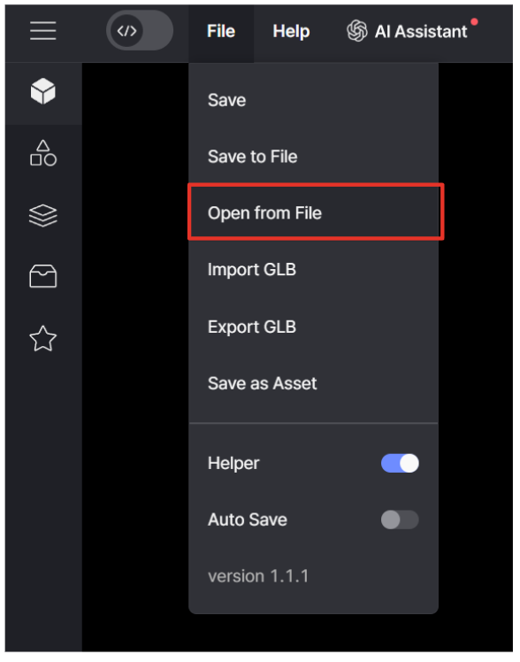

import { Callout } from "nextra/components";
import { Steps } from "nextra/components";

# 스니펫 월드

<Callout type="info">예제 게임에 있는 스니펫을 그대로 쓰고 싶다면?</Callout>

## 스니펫 월드 사용방법

<Steps>

### 파일 다운로드

<Callout emoji="🗂️">
  <a href="/files/Snippet_World_ssafy.json" download>
    스니펫 월드 파일 다운로드.
  </a>
</Callout>

### 파일 열기

레드브릭 스튜디오 상단의 File > Open from File > 다운 받은 파일 선택

 

### 스니펫 시연

오른쪽 상단의 재생 버튼을 눌러 스니펫 시연

 

### 스니펫 찾기

각 트리거에 다가가 원하는 스니펫 찾기

 

### 중지 버튼 클릭

원하는 스니펫을 찾았으면 중지 버튼 클릭

 

### asset 클릭

스니펫의 트리거 및 오브젝트 등 구현된 asset 클릭

 

### 코드 에디터 확인

Script 리스트에서 해당 asset 선택 후 코드 에디터 확인. 코드를 복사하여 프로젝트에 적용

 

<Callout type="warning">
  코드 내 asset 이름을 프로젝트의 asset 이름으로 변경해야 합니다
</Callout>

</Steps>
