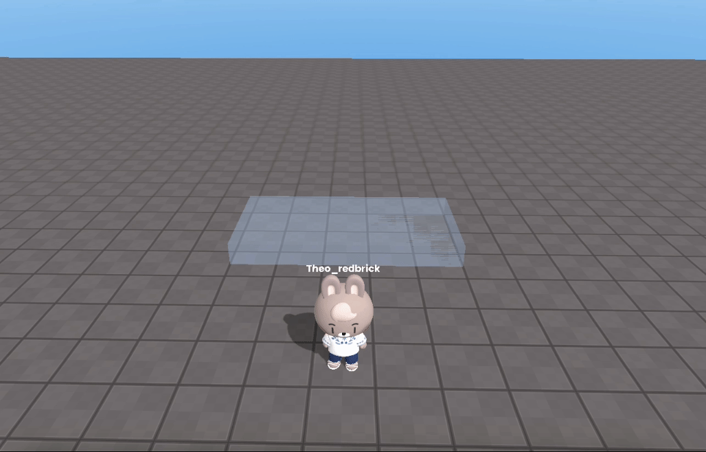

import { Callout, Steps, Cards, Tabs } from "nextra/components";

# 📝 학습 자료

도움이 될만 학습 자료들을 모아놨어요.

## 📖 기본 프로그래밍 알아보기

레드브릭 스튜디오를 다루는 기본적인 방법들을 알아보아요.

<Tabs items = {["오브젝트 움직이기", "오브젝트와 상호 작용하기", "점수 구현하기", "함께해요, 디저트 월드"]}>
  <Tabs.Tab title="오브젝트 움직이기">
    <br />
    <center></center>

    ```js showLineNumbers copy filename="car movement"
    // 오브젝트를 움직이는 코드
    const car = WORLD.getObject("car");
    obj.go(10, 0, 0, 2); //obj가 현재 위치 기준 x+10 위치로 2초동안 이동하게 합니다
    ```

  </Tabs.Tab>

  <Tabs.Tab title="오브젝트와 상호 작용하기">
    <br />
    

    ```js showLineNumbers copy filename="revive"
    const box = WORLD.getObject("box");
    const flowerPot = WORLD.getObject("flowerPot");
    flowerPot.kill(); // flowerPot를 숨깁니다

    box.onCollide(PLAYER, () => {
      flowerPot.revive(); // box와 player가 충돌하면 flowerPot를 보이게 합니다
    });
    ```

  </Tabs.Tab>

  <Tabs.Tab title="점수 구현하기">
    <br />
    

    ```js showLineNumbers copy filename="score"
    const mushroom = WORLD.getObject("mushroom");
    const banner = GUI.getObject("scoreBanner");

    const score = 0;

    mushroom.onCollide(PLAYER, () => {
      score += 1;
      banner.setText(score);
    });
    ```

  </Tabs.Tab>

  <Tabs.Tab title="함께해요, 디저트 월드">
    <br />
    <center></center>

    ```js showLineNumbers copy filename="dessert-world"
    const start1 = WORLD.getObject("start1");
    const start2 = WORLD.getObject("start2");
    const start3 = WORLD.getObject("start3");
    const start4 = WORLD.getObject("start4");
    const start5 = WORLD.getObject("start5");

    const scoreBanner = GUI.getObject("scoreBanner");

    let score = 0;

    start1.onCollide(PLAYER, () => {
      score += 1;
      scoreBanner.setText(score);
      start1.kill();
    });

    start2.onCollide(PLAYER, () => {
      score += 1;
      scoreBanner.setText(score);
      start2.kill();
    });

    start3.onCollide(PLAYER, () => {
      score += 1;
      scoreBanner.setText(score);
      start3.kill();
    });

    start4.onCollide(PLAYER, () => {
      score += 1;
      scoreBanner.setText(score);
      start4.kill();
    });

    start5.onCollide(PLAYER, () => {
      score += 1;
      scoreBanner.setText(score);
      start5.kill();
    });
    ```

  </Tabs.Tab>
</Tabs>

## 🕹️ 더 많이 배우고 싶으시다면 스니펫들을 확인해보세요

레드브릭 엔진에 대해 더 알아보려면 다음 스니펫을 따라주세요. 🎉

<Cards>

<Cards.Card
  title="레드브릭 API 확장"
  href="/snippet/redbrick-extension/spawn"
/>
<Cards.Card title="게임 흐름" href="/snippet/game-flow/pause-game" />
<Cards.Card title="이벤트" href="/snippet/event/breakable-platform" />
<Cards.Card title="3D 객체" href="/snippet/3d-object/object-rotation" />
<Cards.Card title="GUI 객체" href="/snippet/gui-object/play-button" />
<Cards.Card
  title="트윈"
  href="/snippet/tween/beginner/repeatedly-moving-object"
/>
<Cards.Card icon="" title="VR" href="/snippet/vr/intro" />
<Cards.Card title="팁" href="/snippet/tips/debug" />
<Cards.Card title="샘플 게임" href="/snippet/sample-game/shooting-game" />

</Cards>
